# Evaluation Strategies

A RAG answer can go wrong in two places. **Retrieval** can hand the model the wrong chunks, or
none of the right ones. **Generation** can ignore good chunks, add claims they do not contain, or
answer a different question. Evaluating RAG means measuring both halves separately — a bad score
for the whole answer does not say which half to fix — and then checking the whole against what
the right answer actually is.

This guide describes the approaches in use today: what each measures, what it needs, how it
works, and where it misleads. The retrieval strategies it would compare are in
[RAGS.md](./RAGS.md), the chunkings in [CHUNKING_STRATEGIES.md](./CHUNKING_STRATEGIES.md), the
embeddings in [EMBEDDINGS.md](./EMBEDDINGS.md) and the retrievers in [RETRIEVERS.md](./RETRIEVERS.md).

**What this lab measures today** is approach #3: after every answer, the model that answered
grades it 1–5 for *grounded in the chunks* and *answers the question*, next to *chunks found* and
the *best match* cosine in the bottom strip. None of the other approaches below is implemented
yet; each section ends with how it would fit this lab.

**Three things decide what an approach costs:**

- **Ground truth** — does it need an expected answer, or the page the answer is on? Labels are
  the most expensive input: someone has to write them, or a model has to generate them (#2).
- **A judge** — does it need an LLM call? On this laptop an 8B judge costs a few seconds per call,
  and an 8B judge is noisy (see *Validating the evaluator* below).
- **When it can run** — live, after each answer in the chat, or only in a batch over a test set.

| # | Approach | Measures | Ground truth | Judge calls per answer | Runs |
|---|---|---|---|---|---|
| 1 | Retrieval metrics (hit@k, MRR, nDCG) | retrieval | expected page | none | batch or live |
| 2 | Synthetic test sets | makes the labels | none (generates them) | 1 per question, once | offline |
| 3 | Holistic LLM judge *(in the lab)* | both, roughly | none | 1 | live |
| 4 | Faithfulness by claims | generation | none | 1–2 | live |
| 5 | Answer relevance | generation | none | 1 (+ embeddings) | live |
| 6 | Context relevance and precision | retrieval | none | 1 per chunk, or 1 batched | live |
| 7 | Answer correctness | end to end | reference answer | 1 | batch or live |
| 8 | Context recall | retrieval | reference answer | 1 | batch or live |
| 9 | NLI / hallucination detector | generation | none | none (a small local model) | live |
| 10 | Pairwise comparison | end to end | none | 1 per pair (2 with swap) | batch |
| 11 | Unanswerable questions | behaviour | "no answer" labels | 0–1 | batch |
| 12 | Paraphrase consistency | behaviour | none | 1 + a whole extra pipeline run | batch |
| 13 | Distractor robustness | retrieval + generation | a labelled question | as the metric used | batch |
| 14 | Human feedback | end to end | a person | none | live |
| 15 | Operational metrics | cost and speed | none | none | live |

---

## 1. Retrieval metrics against labels

**What it is.** Classic information-retrieval scoring. For each test question you know which
chunk — in practice, which *file and page* — holds the answer. Run retrieval, and score where
(and whether) that page shows up in the top k.

- **Hit rate@k** — 1 if any relevant chunk is in the top k, else 0. Averaged over questions.
- **Recall@k** — relevant chunks found in the top k ÷ all relevant chunks. Differs from hit rate
  when an answer needs several pages.
- **Precision@k** — relevant chunks in the top k ÷ k. How much of the context is noise.
- **MRR** (mean reciprocal rank) — 1 ÷ rank of the first relevant chunk (0 if none), averaged.
  Rewards finding it *first*, which matters when only a few chunks reach the prompt.
- **nDCG@k** — like MRR, but counts every relevant chunk with a log discount by rank, and allows
  graded relevance (2 = answers it, 1 = related).

*Example:* the answer is on page 14. Retrieval returns pages 9, 14, 30, 14. Hit@4 = 1, MRR = ½,
precision@4 = 2⁄4.

**Labels by page, not by chunk.** Chunk ids change with every chunking, but every chunk here
carries its `source` and `page`. A label "question → file + page" therefore scores all eleven
chunkings, six embeddings and six retrievers without relabelling.

### Architecture

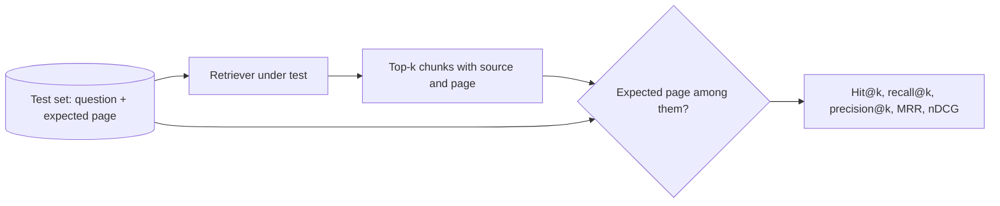

**Pros**
- Deterministic and exact: the same run gives the same number, with no judge to argue with.
- Milliseconds per question: a whole test set runs in seconds, without Ollama.
- The only fair way to compare chunkings, embeddings and retrievers, which change *what is found*
  and nothing else.
- Tells you which half failed: a correct page with a wrong answer is a generation problem.

**Cons**
- Needs labels, and labelling by hand is slow (#2 generates them).
- Says nothing about the answer: a hit can still be answered badly.
- Page labels are coarse: a hit on the right page can still miss the right paragraph, and a
  sentence-window chunk and a whole-page chunk both "hit".
- Misses alternative evidence: if the fact is also on page 80, retrieving page 80 scores 0.

**Fit for this lab.** The cheapest high-value step. Strategies that do not return scored chunks
from the index (CAG sends the whole corpus; GraphRAG sends facts) need their chunk list mapped to
pages, or are left out of retrieval scoring.

---

## 2. Synthetic test sets

**What it is.** Let an LLM write the test set. Pick a chunk, ask the model for a question the
chunk answers, and keep the chunk's page (and the model's answer) as the label. Repeat for a
sample of chunks and you have a labelled test set in minutes instead of hours.

Variants: **multi-hop** questions from two related chunks; **unanswerable** questions (plausible,
but about something the documents never mention) for #11; **persona** questions ("as a beginner,
ask…") for more natural wording.

### Architecture

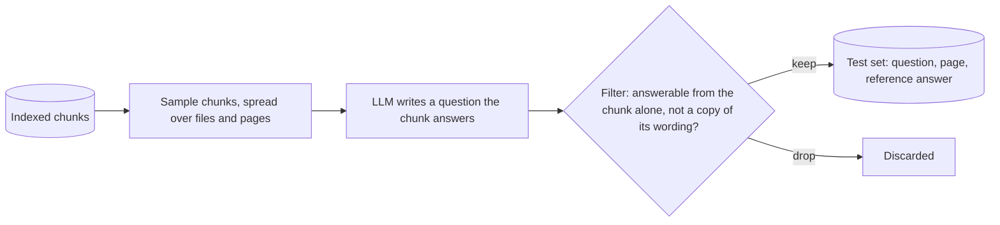

**Pros**
- Labels for free, at any size, for any document you upload.
- Every question has a known source page, so #1 and #8 work immediately.
- Easy to make targeted sets: only tables, only one chapter, only unanswerable questions.

**Cons**
- **Generated questions echo the chunk's own words.** That flatters keyword search (BM25) and
  dense retrieval of the very chunk it came from, and hides the vocabulary-mismatch problem real
  users have. Rephrasing the question in a second call, or filtering out ones with high word
  overlap, reduces this.
- Easy, single-chunk questions dominate unless multi-hop ones are forced.
- The generating model's mistakes become "ground truth": sample and check some by hand.
- A question generated from a chunk *made by one chunking* favours that chunking a little; sample
  from pages rather than chunks to stay neutral.

**Fit for this lab.** The natural source of labels for #1, #7, #8 and #11. Generate once per
document set, save it, and reuse it across every configuration.

---

## 3. Holistic LLM judge *(what the lab does now)*

**What it is.** One prompt shows a judge model the question, the retrieved context and the
answer, and asks for scores on a scale — here, *groundedness* and *relevance*, 1–5 each, with a
one-line reason. The **self-check** variant uses the model that answered as the judge.

### Architecture

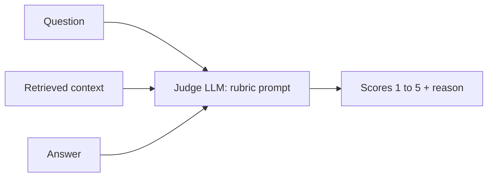

**Pros**
- No labels, one call, runs live after every answer.
- Catches obvious failures: refusals, off-topic answers, invented facts.
- The reason line makes a low score readable.

**Cons**
- **Self-grading is lenient.** A model tends to rate its own output higher than an independent
  judge would. A different judge model removes that bias (but costs a model swap in Ollama).
- **1–5 scales are unstable on small models**: the same answer can move a point between runs,
  and scores cluster at 4–5. Binary questions ("is this claim supported?") are more reliable.
- **Known judge biases:** longer answers look better (verbosity), confident wording looks better,
  and the judge can "know" the answer from its own training and forgive an ungrounded claim.
- One number for the whole answer hides which claim was wrong.
- No ground truth: a faithful answer from a wrong chunk scores 5/5.

**Fit for this lab.** It stays as the always-on first glance. The approaches below sit beside
it, never replace it.

---

## 4. Faithfulness by claims

**What it is.** The RAGAS definition of faithfulness. Split the answer into atomic claims ("the
retention period is 90 days", "it applies to telemetry"), then ask, for each claim, whether the
context supports it — yes or no. Faithfulness = supported claims ÷ all claims.

### Architecture

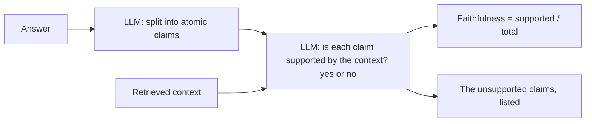

**Pros**
- Binary decisions per claim are far more stable than one 1–5 score.
- Says *which* sentence is the hallucination, not just that there is one.
- Scales naturally: a long answer with one invented detail scores 0.9, not "3".
- No labels; runs live.

**Cons**
- Two calls (split, then verify — or one batched call, which small models handle less well).
- Claim splitting is itself an LLM step and can drop or merge claims.
- A refusal has no claims: define it (1.0, as the lab's current rubric does) rather than divide
  by zero.
- Still blind to correctness: faithfully repeating a wrong chunk scores 1.0.

**Fit for this lab.** The most useful live upgrade over #3's groundedness score. Its unsupported
claims could be shown under the answer, next to *Retrieved chunks*.

---

## 5. Answer relevance

**What it is.** Does the answer address the question that was asked — not whether it is true?
Two ways:

- **Direct judge** — ask a judge, yes/no or 1–5 (what #3 does as *relevance*).
- **Reverse questions (RAGAS)** — ask an LLM to write the questions this answer would be an
  answer to, embed them, and take their mean cosine similarity to the real question. An evasive
  or off-topic answer generates questions that look nothing like the original.

### Architecture

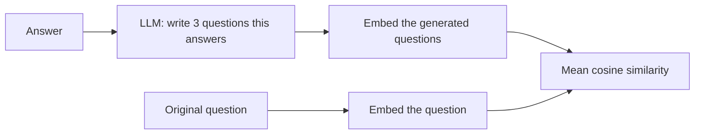

**Pros**
- Catches answers that are true and grounded but beside the point.
- The reverse-question version turns the judgement into an embedding similarity, which is less
  sensitive to the judge's taste.
- No labels; runs live.

**Cons**
- Ignores truth entirely: a confident wrong answer to the right question scores high.
- A refusal scores low, which is correct for an answerable question and wrong for an
  unanswerable one — interpret it together with #11.
- The reverse version depends on the embedding model; scores are comparable within one
  embedding, not across embeddings.

**Fit for this lab.** Reuses the embedding model that is already loaded. Cheap next to #4.

---

## 6. Context relevance and precision

**What it is.** Judges the retrieval without labels. For each retrieved chunk, ask: is this
useful for answering the question? Then:

- **Context relevance** — useful chunks ÷ retrieved chunks.
- **Context precision (RAGAS)** — the same yes/no verdicts, rank-weighted: the mean of
  precision@i over every position i that holds a useful chunk. Useful chunks at the top score
  higher than the same chunks at the bottom.

### Architecture

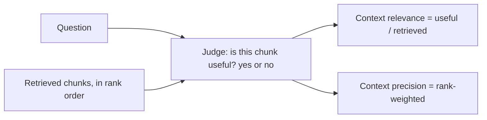

**Pros**
- Measures retrieval without any labels, on any question, live.
- Separates "found nothing useful" from "found it but answered badly".
- Directly comparable across retrievers (MMR, BM25, reranked) on the same question.

**Cons**
- One judge call per chunk, or one batched call that a small model may garble.
- "Useful" is subjective for partially relevant chunks.
- Cannot notice what is *missing*: four relevant but incomplete chunks score perfectly. That is
  #8's job.

**Fit for this lab.** Strategies return 3–4 chunks, so a batched call covers them. Pairs well
with the existing *best match* cosine, which it often contradicts.

---

## 7. Answer correctness against a reference

**What it is.** Compare the answer to a known correct answer. From cheapest to most flexible:

- **Exact match / token F1** (SQuAD-style) — word overlap with the reference. Fine for short
  factual answers ("90 days"), useless for sentences.
- **Semantic similarity** — cosine between the embedded answer and reference.
- **LLM correctness** — a judge splits both into claims and counts true positives (in both),
  false positives (only in the answer) and false negatives (only in the reference), giving an F1.
  RAGAS combines this with semantic similarity.
- ROUGE and BERTScore also exist; both reward wording overlap more than being right.

### Architecture

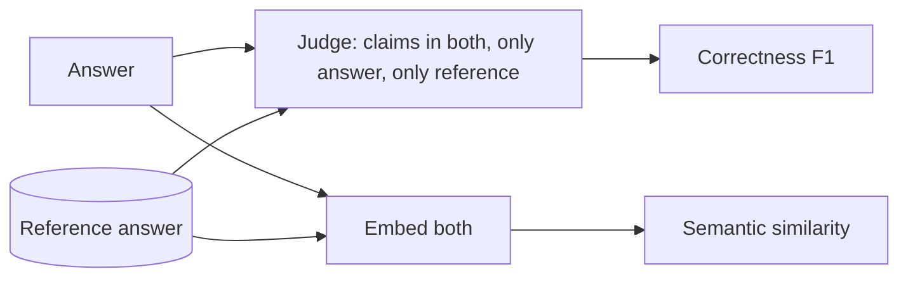

**Pros**
- The only approach that measures whether the answer is *right*.
- Catches the failure every reference-free metric misses: a faithful answer from a wrong chunk.
- Claim-level F1 separates "incomplete" (false negatives) from "adds wrong facts" (false
  positives).

**Cons**
- Needs a reference answer per question.
- A reference can be too narrow: a correct answer that says more, or phrases it differently, is
  penalised by lexical metrics and sometimes by judges.
- Wrong references poison the metric (see #2's cons).

**Fit for this lab.** The headline number for comparing strategies end to end, once a test set
with reference answers exists.

---

## 8. Context recall

**What it is.** Did retrieval bring back *everything* the answer needs? Split the reference answer
into claims and ask, for each, whether the retrieved context contains it. Context recall =
attributable claims ÷ all reference claims. Unlike #1 it needs no page labels, only a reference
answer.

### Architecture

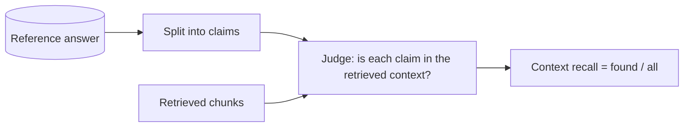

**Pros**
- Measures completeness of retrieval — what #6 cannot see.
- Explains incomplete answers: if recall is 0.5, the generator never had half the facts.
- Works when the evidence is spread over several pages, where page labels get awkward.

**Cons**
- Needs a reference answer, and inherits its mistakes.
- A judge call, with the usual noise.
- Paraphrased evidence can be judged "not present" when it is.

**Fit for this lab.** Especially telling for Multi-hop, Agentic and Branched RAG, whose whole
point is gathering more of the evidence.

---

## 9. NLI / hallucination-detector groundedness

**What it is.** Instead of an LLM judge, a small classifier trained for exactly this task. A
natural-language-inference (NLI) cross-encoder reads a *premise* (the context) and a *hypothesis*
(one sentence of the answer) and returns entailment / neutral / contradiction. Purpose-built
hallucination detectors (Vectara's HHEM, for example) return one consistency score for a pair.
Groundedness = share of answer sentences entailed by the context.

### Architecture

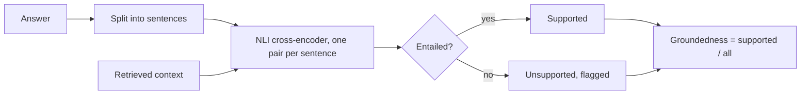

**Pros**
- Deterministic: the same answer always gets the same score.
- No self-grading bias, and no Ollama call: it runs on the CPU in a fraction of a second, like
  the reranker already does.
- Independent of the chat model, so scores stay comparable when the model changes.

**Cons**
- Context windows are small (typically 512 tokens): long contexts must be split and each
  sentence checked against each piece.
- Trained mostly on English and general text; weaker on code, tables and domain jargon.
- Strict: a correct inference that combines two chunks can come out "neutral".
- One more model to download and hold in memory (small, but this laptop has 14 GB).

**Fit for this lab.** A good independent second opinion beside #3/#4: when the LLM judge and the
NLI model disagree, the answer deserves a look. Check the model's licence and size before
choosing one.

---

## 10. Pairwise comparison and win rates

**What it is.** Show a judge the same question answered by two strategies, A and B, and ask which
answer is better (or a tie) — then swap the order and ask again, and keep the verdict only if both
orders agree. Over a test set this gives each pair a **win rate**; over many strategies, a ranking
(Elo or Bradley–Terry), the way chatbot leaderboards rank models.

### Architecture

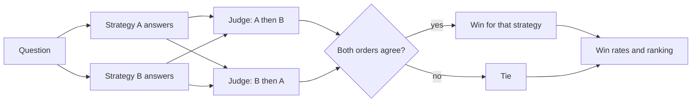

**Pros**
- Judges are much better at "which is better?" than at absolute scores.
- No labels needed, and it measures what matters in a lab: is strategy X better than Y here?
- Answer-level: captures completeness, clarity and correctness together.

**Cons**
- **Position bias**: judges prefer whichever answer comes first (or second). Swapping and
  requiring agreement is mandatory, and doubles the cost.
- Quadratic: 20 strategies are 190 pairs per question. Compare against one baseline (Naive RAG)
  instead, or sample pairs.
- Relative only: "B beats A" says nothing about whether either is good.
- Verbosity bias favours the longer answer.

**Fit for this lab.** Made for it: the lab exists to compare 20 strategies on the same
documents. The cheapest version is "each strategy against Naive RAG" over a test set.

---

## 11. Unanswerable questions (refusal accuracy)

**What it is.** A behavioural test. Mix questions the documents cannot answer into the test set,
and check two things: does the strategy **refuse** the unanswerable ones, and does it **answer**
the answerable ones? That is a 2×2 table — correct answers, correct refusals, hallucinations (an
answer where it should refuse) and over-refusals (a refusal where the answer was there).

### Architecture

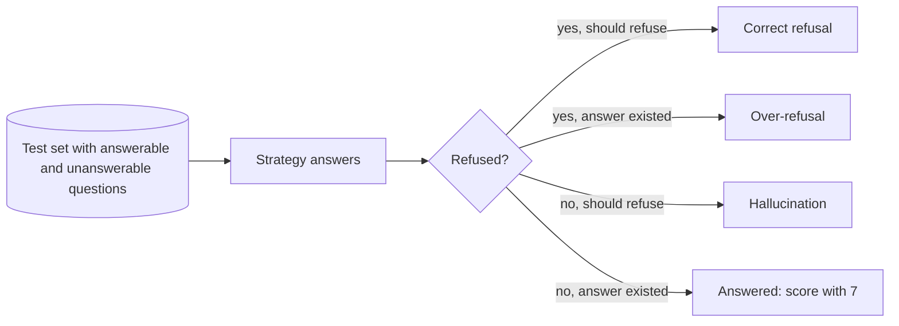

**Pros**
- Measures the failure that hurts most in practice: confident answers with nothing behind them.
- Refusal detection is cheap — a short classifier prompt, or even phrase matching on the lab's
  fixed "I don't know based on the documents" wording.
- Directly tests the strategies built for this: Corrective RAG, Self-RAG, Adaptive RAG, and the
  *similarity with a floor* retriever.

**Cons**
- Needs "no answer" labels, and truly unanswerable questions are hard to write: the documents
  often half-answer them.
- The chat model may answer from its own training knowledge, which is "right" but ungrounded —
  decide whether that counts as a hallucination (in a RAG lab it should).
- Rewards timidity if over-refusals are not counted.

**Fit for this lab.** Few questions go a long way: ten unanswerable questions separate the
strategies that guard against hallucination from those that do not.

---

## 12. Paraphrase consistency

**What it is.** Ask the same question in several wordings (written by an LLM) and check that the
answers agree — same facts, same refusal decision. Agreement is judged pairwise by an LLM, or
approximated by embedding similarity between the answers.

### Architecture

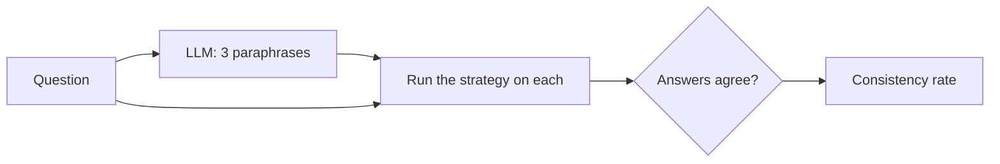

**Pros**
- Exposes brittle retrieval: a strategy that finds the page only for one exact wording.
- No labels needed.
- Shows the value of rewriting strategies (Multi-Query, HyDE), which should be the most stable.

**Cons**
- Expensive: every paraphrase is a whole extra pipeline run.
- Consistent is not correct: a strategy can be reliably wrong.
- Paraphrases can drift in meaning; check that they still ask the same thing.

**Fit for this lab.** A batch-only diagnostic for the query-rewriting strategies, not something
to run on every answer.

---

## 13. Distractor robustness

**What it is.** Add misleading material and see whether the answer survives. Two variants:
**noise** — put irrelevant chunks into the retrieved context; **distractors** — put chunks that
look relevant but say something different (an old version of a policy, a similar product). Then
re-score with #1, #4 or #7 and compare to the clean run.

### Architecture

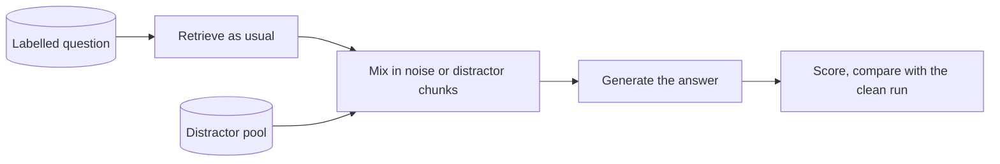

**Pros**
- Tests what production corpora actually contain: duplicates, outdated versions, near-misses.
- Separates generators that read carefully from those that grab the first plausible sentence.
- Shows the value of reranking and grading strategies (Retrieve-and-Rerank, CRAG).

**Cons**
- Building good distractors is manual work, or another generation step with its own errors.
- Artificial: injected chunks bypass retrieval, so it tests the generator more than the pipeline.
- Needs a labelled question and a second metric to score with.

**Fit for this lab.** An advanced step once #1 and #7 exist; the easiest version reuses chunks
from a *different* uploaded document as noise.

---

## 14. Human feedback

**What it is.** A 👍 / 👎 (optionally a short reason) under each answer, stored with the question,
strategy, configuration and scores. Aggregated per strategy, it is the ground truth every other
metric is an approximation of.

### Architecture

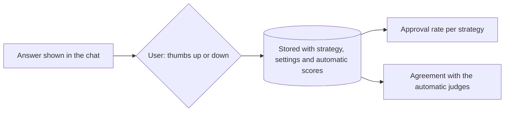

**Pros**
- Measures what the user actually wanted, including things no metric captures (tone, format,
  usefulness).
- The only way to **validate the automatic judges**: if thumbs-down answers scored 5/5, the
  judge is not measuring what matters.
- Nearly free to collect once the button exists.

**Cons**
- Sparse and unsystematic: people rate a few answers, mostly the bad ones.
- Not comparable across strategies unless the same questions are rated under each.
- Personal: one user's 👎 is not another's.

**Fit for this lab.** The accounts and SQLite store already exist, so each rating would belong to
a user and an answer. Most valuable as the check on #3–#10.

---

## 15. Operational metrics

**What it is.** Not quality, but what the quality costs: **latency** per answer, **LLM calls**
and **tokens** per answer, **index build time** and size, **memory**. A strategy that is 3% more
correct and five times slower is not an improvement for most uses.

### Architecture

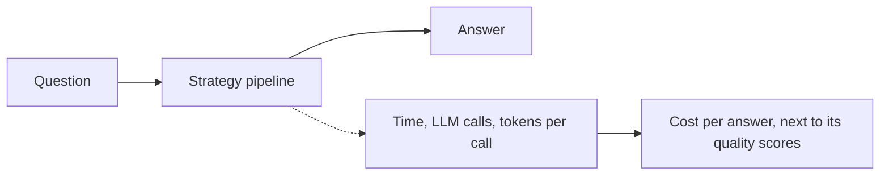

**Pros**
- Objective and free to measure.
- Turns "which strategy is best?" into the real trade-off: quality per second.
- Catches regressions nobody would notice from quality alone (a loop that doubles the calls).

**Cons**
- Hardware-dependent: numbers from this laptop do not transfer.
- Latency varies with Ollama's model loading: the first call after a model swap is slow. Measure
  warm, or report both.

**Fit for this lab.** Half done: every question already logs its duration (see the README's
*Logs*), and the build tables in the README are this approach. Counting LLM calls per answer is
the missing piece.

---

## Frameworks

All of these can use a local Ollama model as the judge. They save writing prompts; they cost
dependencies, and their prompts are tuned for large hosted models.

| Framework | Strength | Watch out for |
|---|---|---|
| **RAGAS** | The reference definitions of #4–#8 and synthetic test generation (#2). | Heavy dependencies; its structured-output prompts often fail on 8B local models. |
| **DeepEval** | pytest-style tests for LLM output, many ready metrics, including RAG ones. | Its own test runner and conventions; a platform upsell around it. |
| **TruLens** | The "RAG triad" (#4, #5, #6) with tracing of each pipeline step. | Instrumentation-heavy; best when the app is built around it. |
| **Arize Phoenix** | Tracing plus evals with a local UI; good for inspecting individual runs. | A separate server and UI to run. |
| **ARES** | Trains small judges on synthetic data and corrects scores with a few human labels. | Research code; needs fine-tuning, which is a project of its own. |
| **promptfoo** | Config-driven comparisons of prompts and models, side by side. | Node-based; aimed at prompts more than retrieval pipelines. |

For a lab of this size the metrics above are each a prompt and a few lines of arithmetic. Writing
them keeps every prompt visible and tunable for the local judge, which is why this project's own
grade prompt already had to be tuned by hand.

---

## Validating the evaluator

An automatic metric is only worth something if it agrees with a careful human. Before trusting
one:

- **Use a judge that is not the answerer.** Self-preference inflates scores (#3's main weakness).
- **Prefer binary verdicts** (supported: yes/no) over 1–5 scales on small models, and set the
  judge's temperature to 0.
- **Hand-label 20–30 answers** and measure agreement with the judge (percentage agreement, or
  Cohen's kappa, which corrects for chance). Below ~70% agreement, fix the prompt or the model
  before comparing strategies.
- **Mind small samples.** On 30 questions, a hit rate of 0.70 against 0.77 is two questions: well
  within noise. Report a confidence interval (bootstrap the questions), and compare strategies on
  the *same* questions.
- **Change one thing at a time.** Chunking, embedding, retriever and strategy all move the
  numbers; a comparison is only meaningful when the rest is fixed.
- **Keep the judge fixed across a comparison.** Scores from two judge models are not comparable.

## Choosing one

- **Comparing chunkings, embeddings or retrievers?** #1 on a test set from #2. Nothing else
  isolates retrieval as cleanly.
- **Want a better live signal than the current self-grade?** #4 with a separate judge model, and
  #9 as a second opinion that costs no Ollama call.
- **Comparing strategies end to end?** #7 on a test set with reference answers, or #10 against
  Naive RAG when there are no references.
- **Worried about hallucination?** #11: ten unanswerable questions say more than a hundred
  groundedness scores.
- **Deciding whether a strategy is worth it?** Put #15 next to whichever quality metric you use.
- **Before trusting any of it:** #14, and the checks under *Validating the evaluator*.

A sensible order to build them in: a synthetic test set with page labels and retrieval metrics
(#2 + #1); then a separate judge with claim-level faithfulness, correctness and refusal accuracy
(#4, #7, #11); then pairwise win rates (#10); then 👍 / 👎 (#14) to check the judges.
