# RAG Architectures — The Complete Guide

A practical catalogue of every current Retrieval-Augmented Generation architecture, with local-first
Python implementations (**uv · Hugging Face · LangChain · LangGraph · Ollama**).

Coverage — **46 architectures**: the 14 topologies from `rag_architectures_guide.pdf`; the
established patterns the PDF missed (Multi-Query/RAG-Fusion, Conversational RAG, RAPTOR, Adaptive
RAG, Iterative/Multi-hop RAG, CAG, Self-Query, Text-to-SQL, Active Retrieval/FLARE, LongRAG,
MemoRAG, LightRAG, Video RAG); the 2025–2026 research frontier; and the training-integrated
ancestors (REALM → RAFT). Every entry has a description, pros/cons, an architecture diagram, a
stack recommendation, and example code.

---

## Quick comparison

| # | Architecture | Core idea | Reach for it when | Maturity |
|---|---|---|---|---|
| 1 | [Naive RAG](#1-naive-rag) | Embed → top-k → stuff prompt | Small clean corpus, first prototype | Production |
| 2 | [Retrieve-and-Rerank](#2-retrieve-and-rerank-advanced-rag) | Wide recall, cross-encoder precision | Top-k is noisy / near-duplicates | Production |
| 3 | [Hybrid RAG](#3-hybrid-rag-dense--sparse) | Dense + BM25, fused | IDs, serials, exact keywords matter | Production |
| 4 | [Multi-Query / RAG-Fusion](#4-multi-query-rag--rag-fusion) | N query rewrites, merged (RRF) | Ambiguous or underspecified queries | Production |
| 5 | [HyDE](#5-hyde-hypothetical-document-embeddings) | Search with a fake ideal answer | Question wording ≠ document wording | Established |
| 6 | [Conversational RAG](#6-conversational-rag-memory-aware) | Condense chat history into the query | Chatbots, follow-up questions | Production |
| 7 | [Hierarchical RAG](#7-hierarchical-rag-parent-child) | Match small chunks, feed big ones | Chunks lose surrounding context | Production |
| 8 | [RAPTOR](#8-raptor-recursive-summary-tree) | Tree of recursive summaries | Answers span whole documents | Established |
| 9 | [Contextual RAG](#9-contextual-rag-anthropic-style) | LLM-written context header per chunk | Chunks are meaningless in isolation | Production |
| 10 | [GraphRAG](#10-graphrag-knowledge-graph) | Entities + relations, multi-hop traversal | "How is A connected to B?" questions | Production |
| 11 | [Multimodal RAG](#11-multimodal-rag) | Index & reason over images/tables | Diagrams, schematics, scanned PDFs | Production |
| 12 | [Corrective RAG (CRAG)](#12-corrective-rag-crag) | Grade retrieval, fall back on failure | Corpus has gaps; wrong context is costly | Established |
| 13 | [Self-RAG](#13-self-rag) | Model critiques its own retrieval & answer | Hallucinations are unacceptable | Established |
| 14 | [Adaptive RAG](#14-adaptive-rag) | Route by query complexity | Mixed trivial/complex traffic | Established |
| 15 | [Iterative / Multi-hop RAG](#15-iterative--multi-hop-rag) | Decompose, retrieve per hop | Multi-step reasoning questions | Established |
| 16 | [Speculative RAG](#16-speculative-rag) | Small model drafts, big model verifies | Big model too slow for every token | Emerging |
| 17 | [Agentic RAG](#17-agentic-rag) | LLM decides which tools to call | Many heterogeneous sources + live data | Production |
| 18 | [Branched / Multi-Source RAG](#18-branched--multi-source-rag) | Parallel fan-out to several indexes | Distinct corpora must be merged | Production |
| 19 | [Modular RAG](#19-modular-rag) | Swappable pipeline components | Long-lived system, evolving needs | Production |
| 20 | [Cache-Augmented Generation (CAG)](#20-cache-augmented-generation-cag) | Preload whole corpus in KV cache | Corpus small (<~100k tokens) & stable | Emerging |
| 21 | [Self-Query / Metadata-Filter RAG](#21-self-query--metadata-filter-rag) | LLM turns the query into filters + search text | Queries mix semantics with hard constraints | Production |
| 22 | [Structured / Tabular RAG](#22-structured--tabular-rag-text-to-sql) | LLM writes SQL, rows become context | Answers live in databases, not prose | Production |
| 23 | [Active Retrieval RAG (FLARE)](#23-active-retrieval-rag-flare--quco-rag) | Retrieve mid-generation on low confidence | Long-form answers drifting into hallucination | Established |
| 24 | [LongRAG](#24-longrag) | Few huge retrieval units + long-context reader | Fragmentation hurts and you have context to spare | Emerging |
| 25 | [MemoRAG](#25-memorag) | Global memory model drafts clues first | Fuzzy questions over one big corpus | Emerging |
| 26 | [LightRAG](#26-lightrag) | Incremental entity graph + dual-level retrieval | GraphRAG quality without GraphRAG cost | Established |
| 27 | [Video RAG (TV-RAG)](#27-video-rag-tv-rag) | Index transcripts + keyframes with timestamps | Answers live inside videos | Emerging |
| 28 | [SURE-RAG](#28-sure-rag-grounded-abstention) | Score evidence support, abstain if weak | A wrong answer costs more than no answer | Research |
| 29 | [HiFi-RAG](#29-hifi-rag-hierarchical-filtering) | Staged filtering funnel + citations | High-precision cited answers | Research |
| 30 | [Bidirectional RAG](#30-bidirectional-rag) | Verified answers written back into the KB | The KB should learn from good answers | Research |
| 31 | [Secure RAG (RAGPart / RAGMask)](#31-secure-rag-ragpart--ragmask) | Partitioned retrieval + majority vote | Untrusted or poisonable corpora | Research |
| 32 | [Predictive Prefetching RAG](#32-predictive-prefetching-rag) | Anticipate and prefetch the next retrievals | Latency-critical assistants | Emerging |
| 33 | [Federated RAG (FD-RAG)](#33-federated-rag-fd-rag) | Retrieve on-device, share only snippets | Data cannot be centralized | Research |
| 34 | [A-RAG](#34-a-rag-agentic-hierarchical-retrieval) | Agent picks the retrieval granularity | Agent needs keyword/chunk/doc zoom levels | Research |
| 35 | [MiA-RAG](#35-mia-rag-mindscape-aware) | Global summaries steer local retrieval | Evidence scattered across long documents | Research |
| 36 | [Disco-RAG](#36-disco-rag-discourse-aware) | Follow discourse links between chunks | Answers span rhetorically connected passages | Research |
| 37 | [HGMem](#37-hgmem-hypergraph-memory) | Hypergraph memory across retrieval steps | Facts must combine over many hops | Research |
| 38 | [MegaRAG / MG2-RAG](#38-megarag--mg2-rag-multimodal-knowledge-graph) | Knowledge graph over text + visuals | Relations span text and figures | Research |
| 39 | [Graph-O1](#39-graph-o1-graph-mcts-reasoning) | MCTS explores the graph step-by-step | Deep relational reasoning, greedy hops fail | Research |
| 40 | [AffordanceRAG](#40-affordancerag-embodied--robotics) | Retrieve actionable object knowledge | Robot manipulation planning | Research |
| 41 | [SignRAG](#41-signrag-visual-reference-matching) | Describe → retrieve references → reason | Identifying items against a reference catalogue | Research |
| 42 | [REALM](#42-realm) | Retriever learned during MLM pretraining | History: where learned retrieval began | Historical |
| 43 | [RETRO](#43-retro) | Cross-attend to neighbors while training | History: trillion-token retrieval LM | Historical |
| 44 | [FiD](#44-fid-fusion-in-decoder) | Encode passages separately, fuse in decoder | Many-passage QA readers | Historical |
| 45 | [Atlas](#45-atlas) | Jointly trained retriever + FiD reader | Few-shot knowledge-intensive tasks | Historical |
| 46 | [RAFT / RA-DIT](#46-raft--ra-dit-retrieval-aware-fine-tuning) | Fine-tune to cite and ignore distractors | Domain-tuning the generator for RAG | Established |

*Maturity:* **Production** = ship it today · **Established** = proven pattern, some assembly ·
**Emerging** = current wave, moving fast · **Research** = single-paper stage, code below is a
sketch of the idea · **Historical** = study it, don't build it.

---

## Setup (shared by all examples)

```bash
uv init rag-lab && cd rag-lab
uv add "langchain>=1.0" "langgraph>=1.0" langchain-ollama langchain-chroma \
       langchain-text-splitters chromadb sentence-transformers rank-bm25 \
       scikit-learn networkx ddgs

ollama pull qwen3:8b            # generator (tool-calling capable)
ollama pull qwen3:1.7b          # small drafter (speculative RAG)
ollama pull nomic-embed-text    # embeddings
ollama pull llama3.2-vision:11b # multimodal RAG only
```

**Recommended local stack**

| Role | Default | Upgrade / alternative |
|---|---|---|
| Model runtime | Ollama | vLLM, llama.cpp |
| Generator LLM | `qwen3:8b` | `llama3.3:70b` (quality), `qwen3:1.7b` (drafting) |
| Embeddings | `nomic-embed-text` (Ollama) | `BAAI/bge-m3` via HF `sentence-transformers` (multilingual) |
| Reranker | `BAAI/bge-reranker-v2-m3` (HF cross-encoder) | `mxbai-rerank-large` |
| Vector DB | Chroma (embedded, zero-ops) | Qdrant / Weaviate (production, native hybrid search) |
| Sparse search | `rank-bm25` | Vector DB built-in BM25 |
| Orchestration | LangChain 1.x (agents, LCEL) + LangGraph 1.x (graphs) | LlamaIndex, Haystack |
| Vision model | `llama3.2-vision:11b` | `qwen2.5vl` |
| Graph store | NetworkX (in-process) | Neo4j |

All snippets target **LangChain 1.x / LangGraph 1.x**. The old retriever wrapper classes
(`MultiQueryRetriever`, `ParentDocumentRetriever`, `EnsembleRetriever`,
`ContextualCompressionRetriever`, …) moved to the `langchain-classic` package in 1.0 — the
examples below hand-roll those few lines instead, so no legacy dependency is needed.

Shared boilerplate every snippet imports — save as `rag_common.py`:

```python
from langchain_ollama import ChatOllama, OllamaEmbeddings
from langchain_chroma import Chroma
from langchain_text_splitters import RecursiveCharacterTextSplitter

llm = ChatOllama(model="qwen3:8b", temperature=0, reasoning=False)
emb = OllamaEmbeddings(model="nomic-embed-text")
splitter = RecursiveCharacterTextSplitter(chunk_size=800, chunk_overlap=100)

def build_store(texts: list[str]) -> Chroma:
    return Chroma.from_documents(splitter.create_documents(texts), embedding=emb)
```

---

## 1. Naive RAG

The foundational linear pipeline: split documents into chunks, embed them into a vector database,
embed the query the same way, fetch the top-k nearest chunks by cosine similarity, and paste them
into the prompt. Everything else in this guide is a patch on one of its failure modes — noisy
retrieval, vocabulary mismatch, missing context, no verification. Always build this first: it is
the baseline every "advanced" variant must beat, and for small clean corpora it often just wins.

**Pros**
- Simplest possible design — one afternoon to production.
- Cheap: one embedding call + one LLM call per query.
- Easy to debug; every stage is inspectable.

**Cons**
- Retrieval quality is the ceiling — garbage chunks in, hallucinations out.
- No handling of ambiguous queries, follow-ups, or multi-hop questions.
- Fixed k: wastes context on easy queries, starves hard ones.

### Architecture

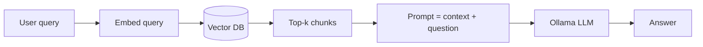

### Implementation

**Stack:** Chroma + `nomic-embed-text` + any Ollama model. No orchestration framework needed.

```python
from rag_common import build_store, llm

store = build_store([open("manual.md").read()])
retriever = store.as_retriever(search_kwargs={"k": 3})

def naive_rag(question: str) -> str:
    context = "\n\n".join(d.page_content for d in retriever.invoke(question))
    return llm.invoke(
        f"Context:\n{context}\n\nQuestion: {question}\nAnswer using ONLY the context."
    ).content
```

---

## 2. Retrieve-and-Rerank (Advanced RAG)

Fixes context pollution. Vector search is tuned for recall, not precision, so this pattern pulls a
wide candidate window (top-20) and then runs a cross-encoder — a Hugging Face model that reads the
query and chunk *together* — to re-score every pair on exact relevance. Only the top 3 survivors
enter the LLM window. A cross-encoder is far more accurate than embedding distance because it
attends across both texts, and small ones run fast on CPU.

**Pros**
- Largest quality jump per line of code of any RAG upgrade.
- Cuts prompt size → faster, cheaper generation on local GPUs.
- Reranker is a drop-in — the rest of the pipeline is untouched.

**Cons**
- Extra model to host; adds ~50–300 ms per query.
- Cannot recover documents the vector search never returned.
- Cross-encoder must be scored one pair at a time (no pre-computation).

### Architecture

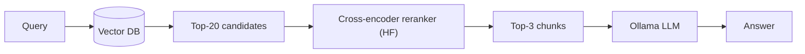

### Implementation

**Stack:** HF `sentence-transformers` `CrossEncoder` used directly — LangChain 1.x moved the old
wrapper classes to `langchain-classic`, and the raw model is fewer lines anyway.

```python
from sentence_transformers import CrossEncoder
from rag_common import build_store, llm

store = build_store([open("manual.md").read()])
reranker = CrossEncoder("BAAI/bge-reranker-v2-m3")

def rerank_rag(question: str) -> str:
    candidates = [d.page_content for d in store.similarity_search(question, k=20)]
    scores = reranker.predict([(question, c) for c in candidates])
    ranked = sorted(zip(scores, candidates), key=lambda t: t[0], reverse=True)
    context = "\n\n".join(c for _, c in ranked[:3])
    return llm.invoke(f"Context:\n{context}\n\nQuestion: {question}").content
```

---

## 3. Hybrid RAG (Dense + Sparse)

Combines semantic vector search with exact keyword matching (BM25), merging both result lists with
Reciprocal Rank Fusion (RRF). Embeddings understand *meaning* but butcher exact tokens: product
serials, error codes (`ERR_771`), device IDs, function names. BM25 nails exact tokens but misses
paraphrases. Fusing both is the standard fix and is built natively into production vector DBs like
Qdrant and Weaviate.

**Pros**
- Catches both "what does this error mean" and "ERR_771" queries.
- RRF needs no score calibration between the two systems.
- Industry default for enterprise search in 2026.

**Cons**
- Two indexes to build and keep in sync.
- Fusion weights need tuning per corpus.
- Still single-shot — no reasoning or verification.

### Architecture

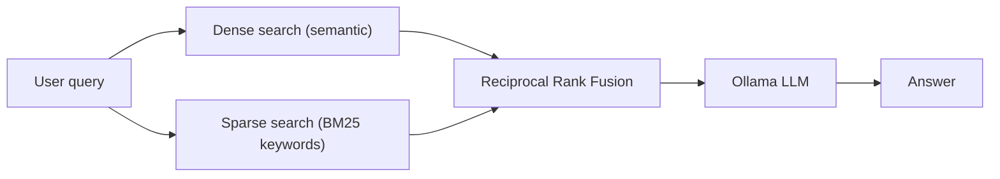

### Implementation

**Stack:** `rank-bm25` + Chroma over the same chunks, fused with ~8 lines of Reciprocal Rank
Fusion. Production: Qdrant with native hybrid search instead of two separate indexes.

```python
from rank_bm25 import BM25Okapi
from langchain_chroma import Chroma
from rag_common import emb, llm, splitter

texts = [d.page_content for d in splitter.create_documents([open("manual.md").read()])]
store = Chroma.from_texts(texts, embedding=emb)
bm25 = BM25Okapi([t.lower().split() for t in texts])

def rrf(rankings: list[list[str]], k: int = 60) -> list[str]:
    scores: dict[str, float] = {}
    for ranked in rankings:
        for rank, doc in enumerate(ranked):
            scores[doc] = scores.get(doc, 0.0) + 1.0 / (k + rank + 1)
    return sorted(scores, key=lambda d: scores[d], reverse=True)

def bm25_top(query: str, k: int = 10) -> list[str]:
    s = bm25.get_scores(query.lower().split())
    return [texts[i] for i in sorted(range(len(texts)), key=s.__getitem__, reverse=True)[:k]]

def hybrid_rag(question: str) -> str:
    dense = [d.page_content for d in store.similarity_search(question, k=10)]
    context = "\n\n".join(rrf([dense, bm25_top(question)])[:4])
    return llm.invoke(f"Context:\n{context}\n\nQuestion: {question}").content
```

---

## 4. Multi-Query RAG / RAG-Fusion

An LLM rewrites the user's question into several alternative phrasings (different vocabulary,
different angles), runs retrieval for each variant in parallel, and merges all ranked lists with
Reciprocal Rank Fusion. Documents that keep appearing across variants float to the top. RAG-Fusion
is this exact pattern with RRF as the merge step. It de-risks the single biggest gamble in RAG:
that one embedding of one phrasing lands near the right chunks.

**Pros**
- Strong on ambiguous, underspecified, or badly-worded queries.
- Trivially parallelizable; no new infrastructure.
- RRF surfaces consensus documents robustly.

**Cons**
- One extra LLM call + N× retrieval per query.
- Query drift: bad rewrites retrieve confidently irrelevant chunks.
- Pointless when queries are already precise.

### Architecture

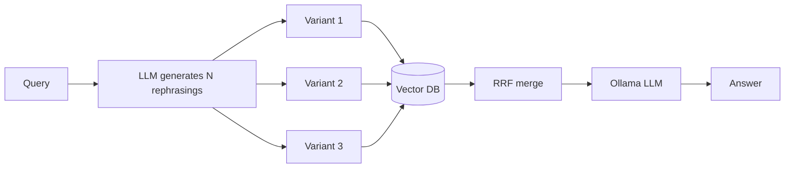

### Implementation

**Stack:** one LLM call for the rewrites + the `rrf()` helper from pattern #3. (The old
`MultiQueryRetriever` wrapper now lives in `langchain-classic`; manual is clearer and shorter.)

```python
from rag_common import build_store, llm
# reuse rrf() from pattern #3

store = build_store([open("manual.md").read()])

def fusion_rag(question: str) -> str:
    rewrites = llm.invoke(
        f"Rewrite this question 3 different ways, one per line, no numbering: {question}"
    ).content.splitlines()
    queries = [question] + [q.strip() for q in rewrites if q.strip()]
    rankings = [[d.page_content for d in store.similarity_search(q, k=5)] for q in queries]
    context = "\n\n".join(rrf(rankings)[:4])
    return llm.invoke(f"Context:\n{context}\n\nQuestion: {question}").content
```

---

## 5. HyDE (Hypothetical Document Embeddings)

Instead of embedding the raw question, the LLM first drafts an imaginary *ideal answer* — a fake
paragraph of documentation — and that hallucination is embedded and used for the vector search.
Questions and answers live in different regions of embedding space ("why does my tracker
disconnect?" vs "AVL units drop TCP sessions when…"); a hypothetical answer lands in the same
region as real answer documents, closing the query–document vocabulary gap with zero index changes.

**Pros**
- Fixes question-vs-documentation phrasing mismatch.
- No re-indexing — purely a query-side trick.
- Works well for technical and legal corpora.

**Cons**
- +1 LLM call of latency before retrieval even starts.
- Hallucinated draft can steer retrieval off-topic on niche domains.
- Ineffective for keyword-style lookups (use Hybrid instead).

### Architecture

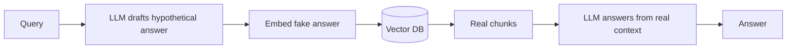

### Implementation

**Stack:** plain two-step with `ChatOllama` — no framework machinery needed.

```python
from rag_common import build_store, llm

store = build_store([open("manual.md").read()])

def hyde_rag(question: str) -> str:
    fake = llm.invoke(
        f"Write one short documentation paragraph that would perfectly answer: {question}"
    ).content
    context = "\n\n".join(d.page_content for d in store.similarity_search(fake, k=3))
    return llm.invoke(f"Real context:\n{context}\n\nQuestion: {question}").content
```

---

## 6. Conversational RAG (Memory-Aware)

RAG for chat. Follow-up turns ("what about the second one?", "and on Linux?") are unsearchable in
isolation, so before retrieval the LLM condenses chat history + new turn into one standalone
question. That rewritten query drives a normal RAG pass, and the answer is generated with both the
retrieved context and the conversation history. Every production RAG chatbot is this pattern; the
PDF guides that skip it produce bots that break on the second message.

**Pros**
- Handles pronouns, ellipsis, and topic threads across turns.
- Composes with any retrieval strategy in this guide.
- Cheap: one extra condensing call per turn.

**Cons**
- Condenser errors poison retrieval invisibly.
- History grows — needs windowing or summarization eventually.
- Session state must live somewhere (checkpointer, DB).

### Architecture

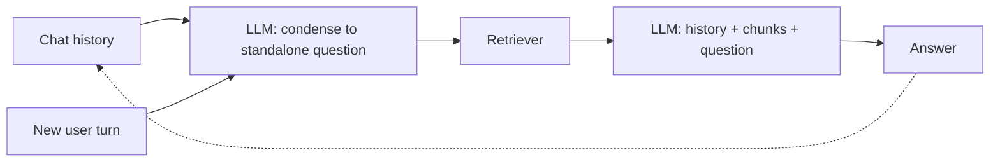

### Implementation

**Stack:** plain loop below; for production use LangGraph 1.x with an `InMemorySaver`
checkpointer (`langgraph.checkpoint.memory` — renamed from `MemorySaver` in 1.0) for
thread-scoped persistent history.

```python
from rag_common import build_store, llm

store = build_store([open("manual.md").read()])
retriever = store.as_retriever(search_kwargs={"k": 3})
history: list[tuple[str, str]] = []

def chat_rag(turn: str) -> str:
    if history:
        transcript = "\n".join(f"user: {u}\nassistant: {a}" for u, a in history)
        standalone = llm.invoke(
            f"Conversation:\n{transcript}\n\nRewrite the user's new message as a "
            f"standalone search question.\nNew message: {turn}"
        ).content
    else:
        standalone = turn
    context = "\n\n".join(d.page_content for d in retriever.invoke(standalone))
    answer = llm.invoke(f"Context:\n{context}\n\nQuestion: {standalone}").content
    history.append((turn, answer))
    return answer
```

---

## 7. Hierarchical RAG (Parent-Child)

Indexes two granularities: tiny child chunks (~100–200 tokens) give razor-sharp embedding matches,
but each child points back to its large parent section (~1000+ tokens), and it is the *parent* that
gets loaded into the LLM. You search with a scalpel and read with a book. Solves the classic
trade-off where small chunks retrieve precisely but lack context, and big chunks have context but
embed mushily. Also known as small-to-big or sentence-window retrieval.

**Pros**
- Precise matching *and* full surrounding context.
- No LLM calls at ingest — just clever storage.
- A dozen lines to hand-roll — no framework machinery needed.

**Cons**
- Two storage layers (vector DB + doc store) to sync.
- Parents can overflow context if k is high.
- Chunk boundary tuning is corpus-specific.

### Architecture

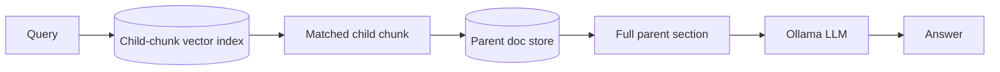

### Implementation

**Stack:** Chroma (children) + a plain dict as the parent store (swap for Redis/SQLite in
production). LangChain 1.x moved `ParentDocumentRetriever` to `langchain-classic`; hand-rolled
it is a dozen lines.

```python
from langchain_chroma import Chroma
from langchain_text_splitters import RecursiveCharacterTextSplitter
from rag_common import emb, llm

parent_split = RecursiveCharacterTextSplitter(chunk_size=1200)
child_split = RecursiveCharacterTextSplitter(chunk_size=200)

parents = {f"p{i}": p for i, p in enumerate(parent_split.split_text(open("manual.md").read()))}
child_texts: list[str] = []
child_meta: list[dict[str, str]] = []
for pid, ptext in parents.items():
    for child in child_split.split_text(ptext):
        child_texts.append(child)
        child_meta.append({"parent_id": pid})
children = Chroma.from_texts(child_texts, embedding=emb, metadatas=child_meta)

def hierarchical_rag(question: str) -> str:
    hits = children.similarity_search(question, k=3)
    parent_ids = dict.fromkeys(h.metadata["parent_id"] for h in hits)  # dedupe, keep order
    context = "\n\n".join(parents[pid] for pid in parent_ids)
    return llm.invoke(f"Context:\n{context}\n\nQuestion: {question}").content
```

---

## 8. RAPTOR (Recursive Summary Tree)

Recursive Abstractive Processing for Tree-Organized Retrieval. At ingest, leaf chunks are embedded,
clustered (Gaussian Mixture), and each cluster is summarized by the LLM; the summaries are then
clustered and summarized again, building a tree from details up to themes. *All* levels are indexed
together ("collapsed tree"), so a query can match a specific paragraph or a whole-book synthesis.
Fixes the failure where answers require information no single chunk contains.

**Pros**
- Answers thematic, whole-corpus questions naive RAG physically cannot.
- Retrieval picks its own altitude — detail or overview.
- Big documented gains on long-document QA benchmarks.

**Cons**
- Expensive ingest: many LLM summarization calls.
- Tree goes stale — updates mean re-clustering the branch.
- Summaries can smooth away load-bearing details.

### Architecture

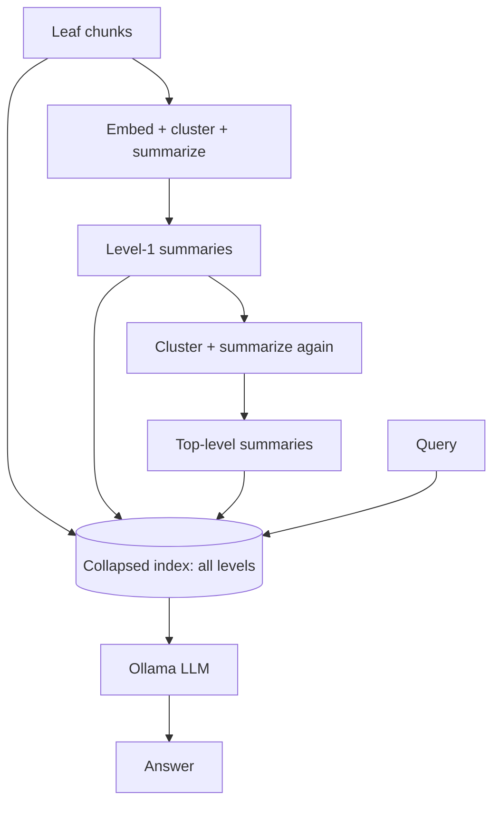

### Implementation

**Stack:** `scikit-learn` GaussianMixture + Ollama summarization + one Chroma index over every level.

```python
import numpy as np
from sklearn.mixture import GaussianMixture
from rag_common import emb, llm, splitter
from langchain_chroma import Chroma

def raptor_nodes(chunks: list[str], levels: int = 2) -> list[str]:
    nodes, layer = list(chunks), chunks
    for _ in range(levels):
        if len(layer) < 4:
            break
        X = np.array(emb.embed_documents(layer))
        n_clusters = max(2, len(layer) // 5)
        labels = GaussianMixture(n_components=n_clusters, random_state=0).fit_predict(X)
        groups = ["\n---\n".join(c for c, g in zip(layer, labels) if g == cid)
                  for cid in range(n_clusters)]
        layer = [llm.invoke("Summarize the key facts of these passages:\n\n" + g).content
                 for g in groups if g]  # skip clusters GMM left empty
        nodes += layer
    return nodes  # ponytail: rebuilds whole tree on update; incremental re-clustering if corpus churns

chunks = [d.page_content for d in splitter.create_documents([open("book.md").read()])]
store = Chroma.from_texts(raptor_nodes(chunks), embedding=emb)

def raptor_rag(question: str) -> str:
    context = "\n\n".join(d.page_content for d in store.similarity_search(question, k=4))
    return llm.invoke(f"Context:\n{context}\n\nQuestion: {question}").content
```

---

## 9. Contextual RAG (Anthropic-style)

Anthropic's contextual retrieval. Chunking destroys context: "the company grew 3%" is unsearchable
when the chunk no longer says which company or which quarter. At ingest, an LLM reads the *whole
document* plus each chunk and writes a 1–2 sentence header situating that chunk ("From ACME Corp's
Q2 2023 SEC filing…"), which is prepended before embedding and BM25 indexing. Anthropic measured
~49% fewer retrieval failures combined with hybrid search, ~67% with reranking on top.

**Pros**
- Large, measured retrieval accuracy gains.
- Pure ingest-time change — query path stays simple.
- Stacks multiplicatively with hybrid search + reranking.

**Cons**
- One LLM call per chunk at ingest (slow locally; cheap in cloud with prompt caching).
- Whole document must fit the enrichment model's context.
- Re-chunking means re-enriching.

### Architecture

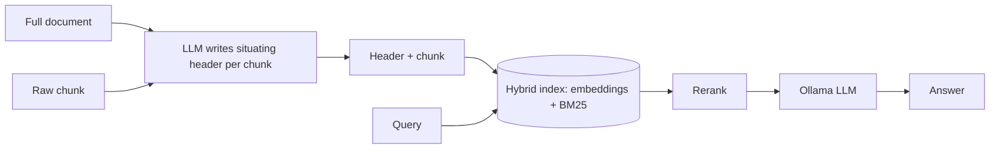

### Implementation

**Stack:** Ollama enrichment loop at ingest, then the Hybrid (#3) + Rerank (#2) query path.

```python
from rag_common import llm, splitter, build_store

def contextualize(document: str, chunk: str) -> str:
    header = llm.invoke(
        f"<document>\n{document[:8000]}\n</document>\n"
        f"<chunk>\n{chunk}\n</chunk>\n"
        "In 1-2 sentences, state where this chunk sits in the document and what it covers, "
        "to improve search retrieval. Answer with only the context."
    ).content
    return f"{header}\n{chunk}"

document = open("filing.md").read()
chunks = [d.page_content for d in splitter.create_documents([document])]
store = build_store([contextualize(document, c) for c in chunks])  # then query like #2/#3
```

---

## 10. GraphRAG (Knowledge Graph)

Replaces "nearest chunks" with structured knowledge. At ingest an LLM extracts entities and
relations (`Service_A —depends_on→ Postgres`) into a graph; at query time the system finds the
question's entities and walks the graph multi-hop, feeding the traversed subgraph (or pre-computed
community summaries, in Microsoft's variant) to the LLM. Vector similarity cannot answer "what
breaks if node 4 dies?" — relationship traversal can.

**Pros**
- Multi-hop relational questions become trivial lookups.
- Explainable: the evidence is a visible path of edges.
- Community summaries answer global "themes of this corpus" queries.

**Cons**
- Heaviest ingest of any RAG — extraction LLM calls over everything.
- Extraction errors poison the graph silently.
- Schema/entity-resolution engineering is real work.

### Architecture

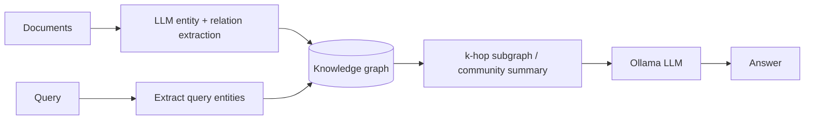

### Implementation

**Stack:** NetworkX in-process for the lazy local version below. Production: Neo4j +
LangChain `LLMGraphTransformer`, or the `graphrag` (Microsoft) / `LightRAG` packages.

```python
import json
import networkx as nx
from rag_common import llm, splitter

G = nx.DiGraph()
for doc in splitter.create_documents([open("runbook.md").read()]):
    raw = llm.invoke(
        'Extract facts as JSON [["subject","relation","object"], ...] only:\n' + doc.page_content
    ).content
    try:
        for s, r, o in json.loads(raw):
            G.add_edge(s.lower(), o.lower(), relation=r)
    except (json.JSONDecodeError, ValueError):
        continue  # ponytail: drop unparseable chunks; use structured output if loss matters

def graph_rag(question: str, hops: int = 2) -> str:
    seeds = llm.invoke(f"List the entities in this question, comma-separated: {question}").content
    nodes: set[str] = set()
    for s in (e.strip().lower() for e in seeds.split(",")):
        if s in G:
            nodes |= set(nx.ego_graph(G.to_undirected(), s, radius=hops))
    facts = "\n".join(f"{u} -[{d['relation']}]-> {v}" for u, v, d in G.edges(nodes, data=True))
    return llm.invoke(f"Known facts:\n{facts}\n\nQuestion: {question}").content
```

---

## 11. Multimodal RAG

Extends retrieval beyond text to images, diagrams, tables, and video frames using local
Vision-Language Models. The pragmatic local recipe: at ingest a VLM writes a rich text description
of every image, those captions are embedded into the same index as text chunks (image path kept in
metadata); at query time, if an image chunk is retrieved, the original image goes to the VLM
alongside the question. Higher-end variants embed images directly with CLIP-style dual encoders.

**Pros**
- Unlocks schematics, dashboards, scanned PDFs, product photos.
- Caption-based version reuses the entire text-RAG stack.
- VLMs run locally via Ollama (`llama3.2-vision`, `qwen2.5vl`).

**Cons**
- Captions lose visual detail the query might need.
- VLM inference is heavy on consumer GPUs.
- True cross-modal embeddings (CLIP) add a second embedding space to manage.

### Architecture

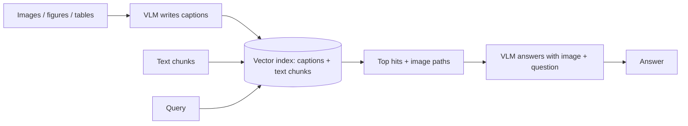

### Implementation

**Stack:** Ollama `llama3.2-vision:11b` for captioning and answering + Chroma for caption embeddings.

```python
import base64
import ollama
from langchain_chroma import Chroma
from rag_common import emb

def see(path: str, prompt: str) -> str:
    img = base64.b64encode(open(path, "rb").read()).decode()
    r = ollama.chat(model="llama3.2-vision:11b",
                    messages=[{"role": "user", "content": prompt, "images": [img]}])
    return r["message"]["content"]

image_paths = ["wiring_diagram.png", "dashboard.png"]
store = Chroma.from_texts(
    [see(p, "Describe this figure in detail for search indexing.") for p in image_paths],
    embedding=emb, metadatas=[{"path": p} for p in image_paths],
)

def multimodal_rag(question: str) -> str:
    hit = store.similarity_search(question, k=1)[0]
    return see(hit.metadata["path"], question)
```

---

## 12. Corrective RAG (CRAG)

Adds a retrieval evaluator between search and generation. A grader LLM scores each retrieved chunk;
if the evidence is relevant, generate as usual — but if it's ambiguous or wrong, the pipeline
*corrects itself*: rewrites the query and falls back to an alternate source (typically web search),
instead of letting the LLM improvise on bad context. This is the "never generate from garbage"
pattern, and the canonical LangGraph tutorial example.

**Pros**
- Catches the deadliest RAG failure: confident answers from irrelevant context.
- Web-search fallback covers corpus gaps automatically.
- Grader is a cheap, small-model job.

**Cons**
- Grader calls add latency to every query.
- Fallback path needs network access (or a second corpus).
- A bad grader either blocks good context or lets junk through.

### Architecture

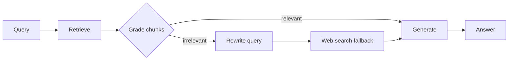

### Implementation

**Stack:** LangGraph `StateGraph` + `ddgs` (DuckDuckGo) as the fallback source.

```python
from typing import TypedDict
from langgraph.graph import StateGraph, START, END
from ddgs import DDGS
from rag_common import build_store, llm

retriever = build_store([open("manual.md").read()]).as_retriever()

class State(TypedDict):
    question: str
    docs: list[str]
    answer: str

def retrieve(state: State) -> dict:
    return {"docs": [d.page_content for d in retriever.invoke(state["question"])]}

def grade(state: State) -> str:
    verdicts = [
        llm.invoke(f"Is this chunk relevant to '{state['question']}'? YES or NO only.\n\n{d}").content
        for d in state["docs"]
    ]
    return "generate" if any("YES" in v.upper() for v in verdicts) else "web_search"

def web_search(state: State) -> dict:
    better = llm.invoke(f"Rewrite as a web search query: {state['question']}").content
    return {"docs": [h["body"] for h in DDGS().text(better, max_results=3)]}

def generate(state: State) -> dict:
    ctx = "\n\n".join(state["docs"])
    return {"answer": llm.invoke(f"Context:\n{ctx}\n\nQuestion: {state['question']}").content}

g = StateGraph(State)
g.add_node(retrieve); g.add_node(web_search); g.add_node(generate)
g.add_edge(START, "retrieve")
g.add_conditional_edges("retrieve", grade)
g.add_edge("web_search", "generate")
g.add_edge("generate", END)
crag = g.compile()

print(crag.invoke({"question": "Why does tracker AVL-01 drop TCP sessions?"})["answer"])
```

---

## 13. Self-RAG

The model reflects on its *own* pipeline at every stage: Do I even need retrieval for this? Are
these chunks actually relevant? Is my draft grounded in them, or did I hallucinate? Does it answer
the question? Failing any check loops back — rewrite the query and re-retrieve, or regenerate. The
original paper fine-tunes special reflection tokens; the practical 2026 version implements each
critique as a small grader prompt in a LangGraph loop.

**Pros**
- Strongest hallucination defense of the single-agent patterns.
- Skips retrieval entirely for questions the model already knows.
- Every verdict is loggable → great observability.

**Cons**
- 2–4× LLM calls per query.
- Loops need hard iteration caps or they spin.
- Grader quality bounds the whole system.

### Architecture

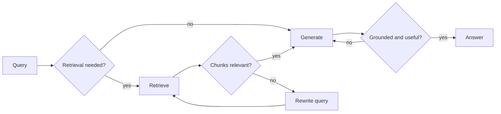

### Implementation

**Stack:** LangGraph. Sketch below shows the three graders wired as conditional edges (add an
attempt counter cap in real use).

```python
from typing import TypedDict
from langgraph.graph import StateGraph, START, END
from rag_common import build_store, llm

retriever = build_store([open("manual.md").read()]).as_retriever()

class State(TypedDict):
    question: str
    docs: list[str]
    answer: str
    tries: int

def ask(prompt: str) -> bool:
    return "YES" in llm.invoke(prompt + "\nAnswer YES or NO only.").content.upper()

def retrieve(state: State) -> dict:
    return {"docs": [d.page_content for d in retriever.invoke(state["question"])]}

def generate(state: State) -> dict:
    ctx = "\n\n".join(state["docs"])
    ans = llm.invoke(f"Context:\n{ctx}\n\nQuestion: {state['question']}").content
    return {"answer": ans, "tries": state.get("tries", 0) + 1}

def route_docs(state: State) -> str:
    ok = ask(f"Are these chunks relevant to '{state['question']}'?\n\n" + "\n".join(state["docs"]))
    return "generate" if ok else "rewrite"

def rewrite(state: State) -> dict:
    return {"question": llm.invoke(f"Rephrase for vector search: {state['question']}").content}

def route_answer(state: State) -> str:
    if state["tries"] >= 2:  # hard cap
        return END
    grounded = ask(f"Docs:\n{chr(10).join(state['docs'])}\n\nAnswer: {state['answer']}\n"
                   "Is every claim supported by the docs?")
    return END if grounded else "generate"

g = StateGraph(State)
g.add_node(retrieve); g.add_node(generate); g.add_node(rewrite)
g.add_edge(START, "retrieve")
g.add_conditional_edges("retrieve", route_docs)
g.add_edge("rewrite", "retrieve")
g.add_conditional_edges("generate", route_answer)
self_rag = g.compile()
```

---

## 14. Adaptive RAG

A router classifies each incoming query by complexity and dispatches it to a matching strategy:
trivial/chitchat → answer directly with no retrieval; simple factual → one-shot vector lookup;
complex/multi-part → iterative multi-hop retrieval (or web search). Based on the Adaptive-RAG paper,
which showed most traffic doesn't need the expensive path. This is the cost-control pattern: pay
for heavy machinery only on queries that need it.

**Pros**
- Big latency/compute savings on mixed real-world traffic.
- Composes the other patterns instead of replacing them.
- Router is one cheap classification call.

**Cons**
- Misrouting sends hard questions down the cheap path.
- Multiple branches to build, test, and monitor.
- Router prompt needs tuning per domain.

### Architecture

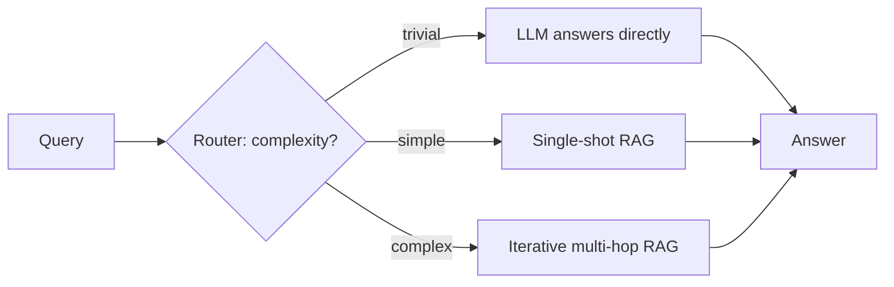

### Implementation

**Stack:** LangGraph conditional entry; branches reuse patterns #1 and #15.

```python
from typing import TypedDict
from langgraph.graph import StateGraph, START, END
from rag_common import build_store, llm

retriever = build_store([open("manual.md").read()]).as_retriever()

class State(TypedDict):
    question: str
    answer: str

def route(state: State) -> str:
    label = llm.invoke(
        f"Classify this query: {state['question']}\n"
        "NONE = answerable without documents, SIMPLE = one document lookup, "
        "COMPLEX = needs multi-step research. Reply with one word."
    ).content.upper()
    return "direct" if "NONE" in label else "single" if "SIMPLE" in label else "multihop"

def direct(state: State) -> dict:
    return {"answer": llm.invoke(state["question"]).content}

def single(state: State) -> dict:
    ctx = "\n\n".join(d.page_content for d in retriever.invoke(state["question"]))
    return {"answer": llm.invoke(f"Context:\n{ctx}\n\nQuestion: {state['question']}").content}

def multihop(state: State) -> dict:
    return {"answer": multi_hop(state["question"])}  # from pattern #15

g = StateGraph(State)
g.add_node(direct); g.add_node(single); g.add_node(multihop)
g.add_conditional_edges(START, route)
g.add_edge("direct", END); g.add_edge("single", END); g.add_edge("multihop", END)
adaptive_rag = g.compile()
```

---

## 15. Iterative / Multi-hop RAG

For questions no single retrieval can answer ("Which port does the device that node 4 hosts use?"),
the system interleaves reasoning and retrieval: decompose the question into a sub-question, retrieve
for it, note the partial answer, and let that evidence shape the *next* sub-question — looping until
enough facts are gathered to synthesize a final answer (IRCoT-style). This is retrieval as
investigation instead of lookup.

**Pros**
- Solves compositional questions that defeat every single-shot pattern.
- Each hop's evidence is auditable.
- Simple to implement as a plain loop.

**Cons**
- Latency multiplies by hop count.
- Early wrong hops derail the whole chain.
- Needs a stopping rule or a hop cap.

### Architecture

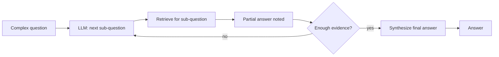

### Implementation

**Stack:** a plain Python loop is enough; graduate to LangGraph when you need checkpointing.

```python
from rag_common import build_store, llm

retriever = build_store([open("runbook.md").read()]).as_retriever(search_kwargs={"k": 3})

def multi_hop(question: str, max_hops: int = 3) -> str:
    notes: list[str] = []
    for _ in range(max_hops):
        known = "\n".join(notes) or "(nothing yet)"
        sub = llm.invoke(
            f"Main question: {question}\nFacts gathered:\n{known}\n\n"
            "State the single next sub-question to research, or reply DONE if answerable."
        ).content
        if "DONE" in sub.upper():
            break
        ctx = "\n\n".join(d.page_content for d in retriever.invoke(sub))
        notes.append(f"Q: {sub}\nA: " + llm.invoke(f"Context:\n{ctx}\n\nAnswer briefly: {sub}").content)
    evidence = "\n\n".join(notes)
    return llm.invoke(f"Evidence:\n{evidence}\n\nAnswer the question: {question}").content
```

---

## 16. Speculative RAG

Splits work between two models: a small fast drafter (1–2B) generates several candidate answers in
parallel, each grounded in a *different subset* of the retrieved evidence with its own rationale;
a large model then does a single cheap verification pass — scoring the drafts and picking (or
correcting) the best one. You get near-big-model quality at near-small-model latency, which is
exactly the trade local GPU setups need.

**Pros**
- Big model runs once, not per-token-of-draft — major speedup.
- Evidence-subset drafts act as an ensemble over perspectives.
- Perfect fit for Ollama boxes with one big + one small model.

**Cons**
- Two models resident in VRAM.
- Verifier can rubber-stamp a wrong draft.
- More moving parts than a single-model pipeline.

### Architecture

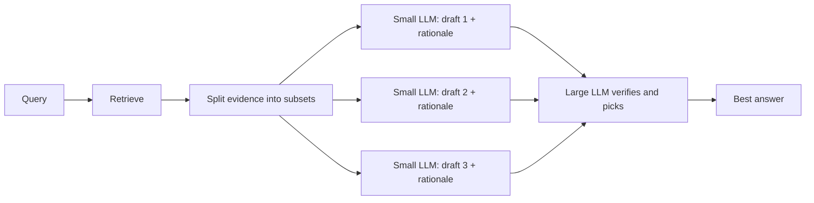

### Implementation

**Stack:** `qwen3:1.7b` drafter + `qwen3:8b` (or larger) verifier via `ChatOllama`.

```python
import re
from langchain_ollama import ChatOllama
from rag_common import build_store

drafter = ChatOllama(model="qwen3:1.7b", temperature=0.7, reasoning=False)
verifier = ChatOllama(model="qwen3:8b", temperature=0, reasoning=False)
retriever = build_store([open("manual.md").read()]).as_retriever(search_kwargs={"k": 3})

def speculative_rag(question: str) -> str:
    docs = [d.page_content for d in retriever.invoke(question)]
    drafts = [  # ponytail: sequential; drafter.batch(...) parallelizes if latency matters
        drafter.invoke(f"Context:\n{d}\n\nQuestion: {question}\nAnswer with a short rationale.").content
        for d in docs
    ]
    menu = "\n\n".join(f"[{i}] {d}" for i, d in enumerate(drafts))
    pick = verifier.invoke(
        f"Question: {question}\n\nCandidate answers:\n{menu}\n\n"
        "Reply with only the number of the best-supported answer."
    ).content
    m = re.search(r"\d+", pick)
    return drafts[int(m.group()) if m else 0]
```

---

## 17. Agentic RAG

Retrieval becomes a *tool* in an LLM agent's toolbox rather than a fixed pipeline stage. The agent
reads the query, plans, and decides: answer directly, search the vector index, hit SQL for live
telemetry, call a web search, or chain several tools — inspecting intermediate results and
retrieving again until it has enough evidence. The dominant 2025–2026 pattern for heterogeneous
enterprise data; multi-agent variants give each source its own specialist agent under a supervisor.

**Pros**
- One entry point over many heterogeneous, live sources.
- Handles queries whose retrieval plan can't be known in advance.
- Extensible: new capability = one new tool function.

**Cons**
- Latency and cost are unbounded without step caps.
- Needs a solid tool-calling model (qwen3, llama3.3).
- Harder to test and make deterministic.

### Architecture

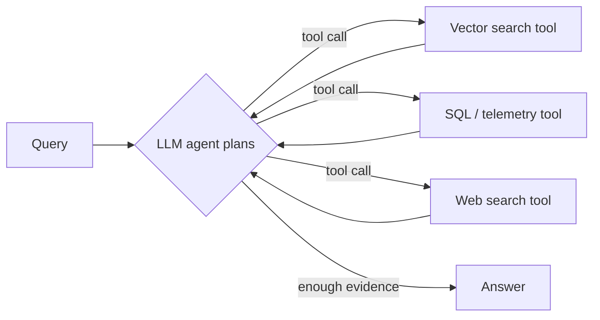

### Implementation

**Stack:** LangChain 1.x `create_agent` — the successor of LangGraph's `create_react_agent`
(deprecated in 1.0) — plus `@tool` functions and a tool-calling Ollama model.

```python
from langchain.agents import create_agent
from langchain.tools import tool
from rag_common import build_store, llm

store = build_store([open("manual.md").read()])

@tool
def search_manuals(query: str) -> str:
    """Search the device manuals knowledge base."""
    return "\n\n".join(d.page_content for d in store.similarity_search(query, k=3))

@tool
def tracker_status(tracker_id: str) -> str:
    """Get live status for a device tracker from the fleet database."""
    return '{"tracker_id": "%s", "status": "OFFLINE", "last_ping": "14 mins ago"}' % tracker_id
    # ponytail: stubbed; point at the real SQL connection here

agent = create_agent(llm, tools=[search_manuals, tracker_status],
                     system_prompt="You are a fleet support engineer.")

result = agent.invoke(
    {"messages": [{"role": "user", "content": "Tracker AVL-7 looks dead - why, and how do I fix it?"}]}
)
print(result["messages"][-1].content)
```

---

## 18. Branched / Multi-Source RAG

Fans a query out to several *different* knowledge stores in parallel — product manuals index,
support-tickets index, SQL warehouse, API — then merges the heterogeneous contexts before a single
synthesis call. Unlike Agentic RAG the routing is static and parallel (no agent deciding), which
makes it fast and predictable: every source is always consulted, results always merge the same way.

**Pros**
- Parallel fan-out ≈ latency of the slowest branch, not the sum.
- Deterministic and easy to test (no agent nondeterminism).
- Natural fit when sources have different owners/formats.

**Cons**
- Queries every source even when one would do (wasted compute).
- Merged context can exceed the window — needs per-branch caps.
- Adding smart routing turns it into Adaptive/Agentic anyway.

### Architecture

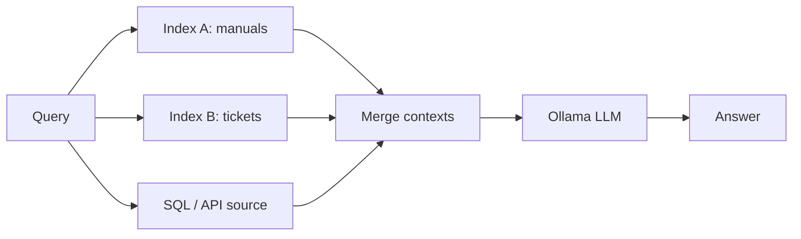

### Implementation

**Stack:** `asyncio.gather` over LangChain async retrievers — stdlib concurrency, no framework.

```python
import asyncio
from rag_common import build_store, llm

manuals = build_store([open("manual.md").read()])
tickets = build_store([open("tickets.md").read()])

async def branched_rag(question: str) -> str:
    hits_a, hits_b = await asyncio.gather(
        manuals.asimilarity_search(question, k=2),
        tickets.asimilarity_search(question, k=2),
    )
    context = "\n\n".join(d.page_content for d in [*hits_a, *hits_b])
    reply = await llm.ainvoke(f"Context from all sources:\n{context}\n\nQuestion: {question}")
    return reply.content

print(asyncio.run(branched_rag("Known fixes for ERR_771 on fleet trackers?")))
```

---

## 19. Modular RAG

Less a topology than an engineering stance: every stage — query rewriting, retrieval, reranking,
generation, verification — is an independent, swappable module behind a stable interface, so you can
recompose the pipeline (swap dense retrieval for graph, insert a reranker, A/B two generators)
without rewrites. In 2026 this is the consensus way to *build* all the other patterns; LangChain's
LCEL and LangGraph nodes are modular RAG frameworks, so don't roll your own module system.

**Pros**
- Swap/A-B any stage without touching the rest.
- Each module is unit-testable in isolation.
- Upgrade path: today naive, tomorrow hybrid+rerank, same skeleton.

**Cons**
- Abstraction overhead is real for one-off scripts (YAGNI).
- Interface design mistakes propagate everywhere.
- Frameworks already do this — hand-rolling duplicates them.

### Architecture

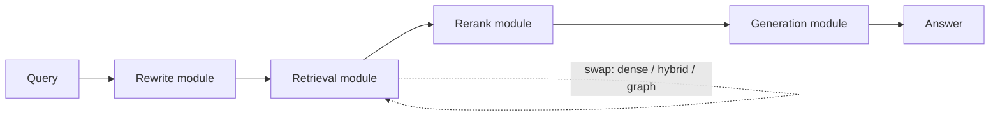

### Implementation

**Stack:** LangChain LCEL (`langchain-core`, unchanged in 1.x) — the pipe operator *is* the
module system. For flows with branching or state, LangChain 1.x now prefers LangGraph nodes
(patterns #12–#14) over long LCEL chains.

```python
from langchain_core.output_parsers import StrOutputParser
from langchain_core.prompts import ChatPromptTemplate
from langchain_core.runnables import RunnablePassthrough
from rag_common import build_store, llm

retriever = build_store([open("manual.md").read()]).as_retriever()  # swap: hybrid, #2 reranked, ...

def format_docs(docs: list) -> str:
    return "\n\n".join(d.page_content for d in docs)

prompt = ChatPromptTemplate.from_template("Context:\n{context}\n\nQuestion: {question}")

modular_rag = (
    {"context": retriever | format_docs, "question": RunnablePassthrough()}
    | prompt
    | llm                      # swap: any ChatModel
    | StrOutputParser()
)

print(modular_rag.invoke("What port does the AVL-01 protocol use?"))
```

---

## 20. Cache-Augmented Generation (CAG)

The retrieval-free sibling. When the whole corpus fits in a long context window (~<100k tokens),
skip the vector database entirely: preload every document into the prompt once, let the runtime
cache the KV state, and answer all subsequent queries against that cached prefix in near-real-time.
No retriever means no retrieval errors. The 2026 consensus: CAG for small, stable, hot corpora;
RAG for large, fresh, per-tenant ones — production routers often use both.

**Pros**
- Zero retrieval failures — the model sees *everything*.
- Fastest per-query path once the cache is warm.
- No chunking, embedding, or vector-DB ops at all.

**Cons**
- Hard corpus size ceiling; VRAM scales with context.
- Any document change invalidates the cache.
- Long-context models degrade on mid-context facts ("lost in the middle").

### Architecture

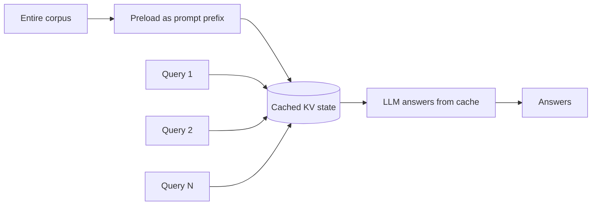

### Implementation

**Stack:** raw `ollama` client — Ollama reuses the KV cache for the shared prefix across calls
(`keep_alive` holds the model + cache in VRAM).

```python
import ollama

KNOWLEDGE = open("corpus.md").read()  # must fit the context window
SYSTEM = f"Answer strictly from this knowledge base:\n\n{KNOWLEDGE}"

def cag(question: str) -> str:
    r = ollama.chat(
        model="qwen3:8b",
        messages=[{"role": "system", "content": SYSTEM},
                  {"role": "user", "content": question}],
        options={"num_ctx": 131072},
        keep_alive="30m",  # keep model + KV cache warm between queries
    )
    return r["message"]["content"]
```

---

## 21. Self-Query / Metadata-Filter RAG

The query itself contains structured constraints ("security advisories **after 2024** about
**Postgres**"), which cosine similarity cannot enforce. An LLM splits the natural-language
question into a semantic search string plus hard metadata filters (category, dates, numeric
ranges) that the vector DB applies exactly. Formerly LangChain's `SelfQueryRetriever` (now in
`langchain-classic`); with 1.x structured output it's a dozen lines. Requires chunks to carry
clean metadata at ingest.

**Pros**
- Hard constraints are enforced exactly, not "semantically".
- One cheap extraction call; composes with every other pattern.
- Kills a whole class of "right topic, wrong year" retrieval errors.

**Cons**
- Only as good as the metadata attached at ingest.
- A wrong parse silently filters out everything.
- The LLM must be told the metadata schema.

### Architecture

```mermaid
flowchart LR
    Q["Natural-language query"] --> P["LLM: structured parse"]
    P --> F["Metadata filters"]
    P --> S["Semantic search text"]
    F --> VS[("Vector DB with where-clause")]
    S --> VS
    VS --> LLM["Ollama LLM"]
    LLM --> A["Answer"]
```

### Implementation

**Stack:** `ChatOllama.with_structured_output` (Pydantic) + Chroma metadata filters.

```python
from pydantic import BaseModel
from rag_common import build_store, llm

store = build_store([open("catalog.md").read()])  # real ingest: attach metadata per chunk

class Search(BaseModel):
    query: str
    category: str | None = None
    year_min: int | None = None

def self_query_rag(question: str) -> str:
    s = llm.with_structured_output(Search).invoke(
        f"Extract the semantic search text and any hard filters from: {question}"
    )
    where: dict = {}
    if s.category:
        where["category"] = s.category
    if s.year_min:
        where["year"] = {"$gte": s.year_min}
    hits = store.similarity_search(s.query, k=4, filter=where or None)
    context = "\n\n".join(d.page_content for d in hits)
    return llm.invoke(f"Context:\n{context}\n\nQuestion: {question}").content
```

---

## 22. Structured / Tabular RAG (Text-to-SQL)

Retrieval from databases and tables instead of prose. The LLM is shown the schema, writes a SQL
query, the query is executed, and the returned rows become the generation context. Aggregates,
joins, and counts ("how many trackers went offline this week?") are unanswerable by similarity
search over text but trivial for SQL. FT-RAG (2026 research) extends this to messy documents by
decomposing tables into entry-level semantic units in a structured graph.

**Pros**
- Exact numbers, aggregates, and joins — no embedding fuzziness.
- Always fresh: queries hit the live database.
- Stdlib `sqlite3` is enough to start.

**Cons**
- LLM-written SQL is a trust boundary: must be read-only and SELECT-guarded.
- Schema drift silently breaks the prompt.
- Wrong-but-valid SQL returns confident wrong answers; add a retry/critique loop.

### Architecture

```mermaid
flowchart LR
    Q["Question"] --> GEN["LLM writes SQL from schema"]
    GEN --> SQL["SELECT ..."]
    SQL --> DB[("Read-only database")]
    DB --> ROWS["Result rows"]
    ROWS --> LLM["LLM answers from rows"]
    LLM --> A["Answer"]
```

### Implementation

**Stack:** stdlib `sqlite3` (read-only URI) + Ollama. Same shape works for Postgres via `psycopg`.

```python
import sqlite3
from rag_common import llm

db = sqlite3.connect("file:fleet.db?mode=ro", uri=True)  # read-only: the LLM writes this SQL
SCHEMA = "\n".join(r[0] for r in db.execute(
    "SELECT sql FROM sqlite_master WHERE type='table'"))

def sql_rag(question: str) -> str:
    sql = llm.invoke(
        f"Schema:\n{SCHEMA}\n\nWrite ONE SQLite SELECT statement (no prose, no markdown) "
        f"answering: {question}"
    ).content.strip().strip("`").strip()
    if not sql.lower().lstrip("( ").startswith("select"):
        return "Refused: generated statement was not a SELECT."
    rows = db.execute(sql).fetchmany(50)
    return llm.invoke(
        f"Question: {question}\nSQL used: {sql}\nRows: {rows}\n\nAnswer from these rows."
    ).content
```

---

## 23. Active Retrieval RAG (FLARE / QuCo-RAG)

Retrieval interleaved with *generation* instead of preceding it. The model generates ahead; when a
span is low-confidence (token log-probs in the FLARE paper; self-flagged claims in the local
version below), that span becomes a search query, evidence is fetched, and the sentence is
regenerated grounded. QuCo-RAG (2026) triggers on pretraining-corpus statistics instead — rare
entities signal knowledge gaps. Fixes long-form answers that start grounded and drift into
hallucination three paragraphs in.

**Pros**
- Retrieves exactly when and what the generation actually needs.
- Long-form output stays grounded past the first paragraph.
- Skips retrieval entirely while the model is confident.

**Cons**
- Interleaving multiplies latency on long answers.
- Ollama doesn't expose clean token log-probs — local triggers are heuristic.
- Harder to cache than one-shot retrieval.

### Architecture

```mermaid
flowchart LR
    Q["Question"] --> G["Generate next span"]
    G --> C{"Confident?"}
    C -- "yes" --> APP["Append to answer"]
    C -- "no" --> R["Retrieve for the shaky span"]
    R --> RG["Regenerate span grounded"]
    RG --> APP
    APP --> D{"Answer complete?"}
    D -- "no" --> G
    D -- "yes" --> A["Answer"]
```

### Implementation

**Stack:** plain loop + self-flagging prompt (true FLARE uses log-prob thresholds).

```python
from rag_common import build_store, llm

retriever = build_store([open("manual.md").read()]).as_retriever(search_kwargs={"k": 3})

def flare_rag(question: str, max_rounds: int = 4) -> str:
    answer = ""
    for _ in range(max_rounds):
        nxt = llm.invoke(
            f"Question: {question}\nAnswer so far: {answer or '(none)'}\n"
            "Write the next sentence of the answer. Mark any fact you are not sure of as "
            "[CHECK: <search phrase>]. If the answer is complete, reply DONE."
        ).content
        if "DONE" in nxt.upper():
            break
        if "[CHECK:" in nxt:
            phrase = nxt.split("[CHECK:", 1)[1].split("]", 1)[0]
            ctx = "\n".join(d.page_content for d in retriever.invoke(phrase))
            nxt = llm.invoke(
                f"Evidence:\n{ctx}\n\nRewrite with verified facts only: {nxt}"
            ).content
        answer += " " + nxt
    return answer.strip()
```

---

## 24. LongRAG

Inverts the chunking dogma: retrieval units are *huge* (whole sections or documents, 4k+ tokens),
only 1–2 units are retrieved, and a long-context reader digests them. Fewer, more distinctive
units make the retriever's job easier and eliminate fragmentation — the answer's surrounding
argument arrives intact. Needs a long-context embedder (`bge-m3`, 8k tokens) and a reader with
headroom (`qwen3` at 32k+). The halfway house between classic RAG and CAG (#20).

**Pros**
- Fragmentation and lost-context problems vanish by construction.
- Far fewer index entries — cheaper, more distinctive retrieval.
- Rides the long-context wave instead of fighting it.

**Cons**
- Reader must genuinely handle long inputs ("lost in the middle" risk).
- Coarse retrieval: one wrong unit wastes half the window.
- Long-unit embeddings blur multi-topic documents.

### Architecture

```mermaid
flowchart LR
    D["Corpus"] --> U["Split into huge units (4k+ tokens)"]
    U --> IDX[("Long-unit index (bge-m3)")]
    Q["Query"] --> IDX
    IDX --> TOP["Top 1-2 whole units"]
    TOP --> RD["Long-context reader (32k)"]
    RD --> A["Answer"]
```

### Implementation

**Stack:** `bge-m3` embeddings (8k window, `ollama pull bge-m3`) + `qwen3:8b` with a 32k context.

```python
from langchain_chroma import Chroma
from langchain_ollama import ChatOllama, OllamaEmbeddings
from langchain_text_splitters import RecursiveCharacterTextSplitter

long_emb = OllamaEmbeddings(model="bge-m3")                 # long-window embedder
reader = ChatOllama(model="qwen3:8b", num_ctx=32768, temperature=0, reasoning=False)

units = RecursiveCharacterTextSplitter(chunk_size=12000, chunk_overlap=500)\
    .split_text(open("book.md").read())                     # ~4k-token retrieval units
store = Chroma.from_texts(units, embedding=long_emb)

def long_rag(question: str) -> str:
    context = "\n\n=====\n\n".join(
        d.page_content for d in store.similarity_search(question, k=2))
    return reader.invoke(f"Context:\n{context}\n\nQuestion: {question}").content
```

---

## 25. MemoRAG

A two-model design for questions too fuzzy to embed ("what themes connect chapters 3 and 7?"). A
cheap long-context *memory model* ingests the whole corpus once into a compressed global memory;
per query it drafts clue answers and key spans from that memory, and the clues — not the raw
question — drive precise vector retrieval for a strong generator. The `memorag` package ships
trained memory models; the pattern also works with any long-context Ollama model.

**Pros**
- Answers global, vague, or thematic queries the query-embedding can't reach.
- Memory pass happens once per corpus, then is reused.
- Clue-driven retrieval is far more precise than raw-question retrieval.

**Cons**
- Two models to run; memory model needs a big context.
- Memory goes stale when the corpus changes.
- Young ecosystem compared to plain RAG.

### Architecture

```mermaid
flowchart LR
    C["Whole corpus"] --> M["Memory model: compressed global memory"]
    Q["Fuzzy query"] --> M
    M --> CL["Draft clues / key spans"]
    CL --> VS[("Vector index")]
    VS --> E["Precise evidence"]
    E --> GEN["Strong generator"]
    GEN --> A["Answer"]
```

### Implementation

**Stack:** `uv add memorag` for the real thing (models like `TommyChien/memorag-qwen2-7b-inst`);
pattern sketch below with a long-context Ollama model as the memory.

```python
from langchain_ollama import ChatOllama
from rag_common import build_store, llm

memory_llm = ChatOllama(model="qwen3:8b", num_ctx=131072, reasoning=False)
corpus = open("book.md").read()
store = build_store([corpus])

def memo_rag(question: str) -> str:
    clues = memory_llm.invoke(          # global pass: memory drafts retrieval clues
        f"{corpus[:100_000]}\n\n---\nQuestion: {question}\n"
        "List 3 short quotes or keywords from the text likely to contain the answer, one per line."
    ).content.splitlines()
    hits = {h.page_content for clue in clues if clue.strip()
            for h in store.similarity_search(clue, k=2)}
    return llm.invoke(
        "Context:\n" + "\n\n".join(hits) + f"\n\nQuestion: {question}"
    ).content
```

---

## 26. LightRAG

The pragmatic GraphRAG (HKU, 2024, widely adopted OSS). Extracts an entity/relation graph like
#10, but retrieves at *dual levels* — low-level (specific entities and their facts) and high-level
(themes and abstractions) — blended with vector search. Its killer feature over Microsoft
GraphRAG: **incremental updates** — new documents merge into the existing graph instead of forcing
a full rebuild, at a fraction of the token cost. Native Ollama support. Related: KAG (OpenSPG)
adds logic-form reasoning over domain knowledge graphs.

**Pros**
- Near-GraphRAG answer quality at a fraction of the ingest cost.
- Incremental inserts — no full re-index on corpus changes.
- Pip-installable with built-in Ollama bindings.

**Cons**
- Still LLM-extraction-bound: bad extractions poison the graph.
- Younger and less battle-tested than vector-only stacks.
- API surface moves fast between releases.

### Architecture

```mermaid
flowchart LR
    D["Documents"] --> EX["LLM extraction (incremental)"]
    EX --> KG[("Entity graph + vector index")]
    Q["Query"] --> KW["Extract low + high level keywords"]
    KW --> L1["Low-level: entity facts"]
    KW --> L2["High-level: themes"]
    KG --> L1
    KG --> L2
    L1 --> GEN["LLM"]
    L2 --> GEN
    GEN --> A["Answer"]
```

### Implementation

**Stack:** `uv add lightrag-hku` + Ollama for both LLM and embeddings.

```python
from lightrag import LightRAG, QueryParam
from lightrag.llm.ollama import ollama_model_complete, ollama_embed
from lightrag.utils import EmbeddingFunc

rag = LightRAG(                       # kwargs drift between releases - check the repo README
    working_dir="./lightrag_store",
    llm_model_func=ollama_model_complete,
    llm_model_name="qwen3:8b",
    embedding_func=EmbeddingFunc(
        embedding_dim=768, max_token_size=8192,
        func=lambda texts: ollama_embed(texts, embed_model="nomic-embed-text"),
    ),
)
rag.insert(open("runbook.md").read())              # incremental: call again for new docs
print(rag.query("What depends on PostgreSQL_Core?",
                param=QueryParam(mode="hybrid")))  # modes: local / global / hybrid / naive
```

---

## 27. Video RAG (TV-RAG)

Makes video searchable: sample keyframes, caption them with a VLM, index captions *with
timestamps* alongside the audio transcript (Whisper); retrieval returns a time-anchored segment,
and the VLM answers over the actual frame plus the question. TV-RAG (2026 research) sharpens the
recipe with temporal awareness — time offsets in retrieval and entropy-weighted keyframe sampling
so information-dense moments get more frames.

**Pros**
- Hours of video become a queryable, timestamped knowledge base.
- Reuses the whole text-RAG stack — captions are just documents.
- Answers arrive with a jump-to timestamp for free.

**Cons**
- Ingest is heavy: frame extraction + VLM captioning per video.
- Fixed-rate sampling misses blink-and-gone details.
- Transcript and frames must be aligned carefully.

### Architecture

```mermaid
flowchart LR
    V["Video"] --> FR["Sample keyframes (ffmpeg)"]
    V --> TR["Whisper transcript"]
    FR --> CAP["VLM captions + timestamps"]
    CAP --> IDX[("Vector index")]
    TR --> IDX
    Q["Query"] --> IDX
    IDX --> SEG["Best segment + frame"]
    SEG --> VLM["VLM answers over frame"]
    VLM --> A["Answer + timestamp"]
```

### Implementation

**Stack:** `ffmpeg` for frames, `llama3.2-vision:11b` for captions/answers, Chroma for the index.

```python
# ffmpeg -i talk.mp4 -vf fps=1/10 frames/f_%04d.jpg     (one frame every 10 s)
import base64, glob
import ollama
from langchain_chroma import Chroma
from rag_common import emb

def see(path: str, prompt: str) -> str:
    img = base64.b64encode(open(path, "rb").read()).decode()
    r = ollama.chat(model="llama3.2-vision:11b",
                    messages=[{"role": "user", "content": prompt, "images": [img]}])
    return r["message"]["content"]

frames = sorted(glob.glob("frames/*.jpg"))
store = Chroma.from_texts(
    [see(f, "Describe this video frame for search indexing.") for f in frames],
    embedding=emb,
    metadatas=[{"path": f, "t_sec": i * 10} for i, f in enumerate(frames)],
)  # production: index the Whisper transcript into the same store

def video_rag(question: str) -> str:
    hit = store.similarity_search(question, k=1)[0]
    t = hit.metadata["t_sec"]
    return f"[t={t}s] " + see(hit.metadata["path"], question)
```

---

## 28. SURE-RAG (Grounded Abstention)

Adds an explicit *support check* between drafting and answering: does the retrieved evidence
actually entail the draft answer? Full support → answer; partial → answer with a disclosed
confidence caveat; none → abstain ("the knowledge base doesn't cover this") instead of bluffing.
2026 research formalizes the scoring; the pattern itself is one grader call and pays for itself
anywhere a wrong answer costs more than no answer — medical, legal, ops runbooks.

**Pros**
- Converts silent hallucinations into honest "I don't know".
- One extra LLM call; trivially bolts onto any pipeline.
- Abstention rate is a free retrieval-quality metric.

**Cons**
- Over-cautious graders frustrate users with refusals.
- Entailment judged by an LLM is itself fallible.
- Doesn't *fix* weak retrieval, only reports it.

### Architecture

```mermaid
flowchart LR
    Q["Query"] --> R["Retrieve"]
    R --> G["Draft answer"]
    G --> S{"Evidence supports draft?"}
    S -- "fully" --> A["Answer"]
    S -- "partially" --> P["Answer + caveat"]
    S -- "no" --> AB["Abstain"]
```

### Implementation

**Stack:** any base pipeline + one grader prompt.

```python
from rag_common import build_store, llm

retriever = build_store([open("manual.md").read()]).as_retriever()

def sure_rag(question: str) -> str:
    ctx = "\n\n".join(d.page_content for d in retriever.invoke(question))
    draft = llm.invoke(f"Context:\n{ctx}\n\nQuestion: {question}").content
    support = llm.invoke(
        f"Context:\n{ctx}\n\nClaimed answer: {draft}\n"
        "How fully does the context support the answer? Reply FULL, PARTIAL or NONE."
    ).content.upper()
    if "FULL" in support:
        return draft
    if "PARTIAL" in support:
        return f"(Low confidence - evidence is incomplete.) {draft}"
    return "I don't know - the knowledge base doesn't cover this."
```

---

## 29. HiFi-RAG (Hierarchical Filtering)

A precision funnel: cast a wide net (top-30 by embeddings), cut hard with a cross-encoder
(top-8), then have the LLM itself keep or drop each survivor, and generate only from numbered
survivors with `[n]` citations attached. Each stage removes noise the previous, cheaper stage let
through; citations fall out of the numbering for free. 2026 research packaging of a pattern
production teams converged on independently.

**Pros**
- Very high context precision — generation sees only vetted passages.
- Inline citations with zero extra machinery.
- Each stage is independently tunable and observable.

**Cons**
- Three stages of latency before generation starts.
- Aggressive filtering can drop the one load-bearing passage.
- Per-passage LLM filtering is the expensive stage.

### Architecture

```mermaid
flowchart LR
    Q["Query"] --> S1["Stage 1: embeddings top-30"]
    S1 --> S2["Stage 2: cross-encoder top-8"]
    S2 --> S3["Stage 3: LLM keep/drop"]
    S3 --> GEN["Generate with numbered citations"]
    GEN --> A["Cited answer"]
```

### Implementation

**Stack:** Chroma + `bge-reranker-v2-m3` (as in #2) + one filter prompt per survivor.

```python
from sentence_transformers import CrossEncoder
from rag_common import build_store, llm

store = build_store([open("manual.md").read()])
reranker = CrossEncoder("BAAI/bge-reranker-v2-m3")

def hifi_rag(question: str) -> str:
    stage1 = [d.page_content for d in store.similarity_search(question, k=30)]
    scores = reranker.predict([(question, c) for c in stage1])
    stage2 = [c for _, c in sorted(zip(scores, stage1), key=lambda t: -t[0])[:8]]
    stage3 = [c for c in stage2 if "YES" in llm.invoke(
        f"Does this passage help answer '{question}'? YES or NO.\n\n{c}").content.upper()]
    ctx = "\n\n".join(f"[{i + 1}] {c}" for i, c in enumerate(stage3))
    return llm.invoke(
        f"Context:\n{ctx}\n\nQuestion: {question}\nCite passages as [n] after each claim."
    ).content
```

---

## 30. Bidirectional RAG

Retrieval flows both ways: answers that pass a groundedness verification get written *back* into
the knowledge base as new retrievable entries (question + verified answer, tagged with
provenance). Future queries hit the distilled answer directly instead of re-deriving it from raw
chunks. The 2026 research adds controlled-update guarantees. The hazard is obvious — an
unverified write-back loop composts the corpus with model output — so gate writes hard and tag
them for audit and rollback.

**Pros**
- KB improves with use; repeated questions get faster and sharper.
- Distilled Q+A entries are ideal retrieval targets.
- Provenance tags keep generated knowledge separable and revocable.

**Cons**
- Feedback-loop pollution if verification is weak — gate hard, review often.
- Generated entries can shadow fresher source documents.
- Compliance: model output stored as "knowledge" needs governance.

### Architecture

```mermaid
flowchart LR
    Q["Query"] --> R["Retrieve"]
    R --> GEN["Generate"]
    GEN --> V{"Grounded + novel?"}
    V -- "yes" --> W["Write Q+A back to KB (tagged)"]
    W --> KB[("Knowledge base")]
    KB --> R
    V --> A["Answer"]
```

### Implementation

**Stack:** any pipeline + `store.add_texts` behind a verification gate.

```python
from rag_common import build_store, llm

store = build_store([open("manual.md").read()])
retriever = store.as_retriever()

def bidirectional_rag(question: str) -> str:
    ctx = "\n\n".join(d.page_content for d in retriever.invoke(question))
    answer = llm.invoke(f"Context:\n{ctx}\n\nQuestion: {question}").content
    grounded = "YES" in llm.invoke(
        f"Context:\n{ctx}\n\nAnswer: {answer}\n"
        "Is every claim in the answer supported by the context? YES or NO."
    ).content.upper()
    if grounded:  # production: add human review before writes, or the KB self-pollutes
        store.add_texts(
            [f"Q: {question}\nVerified answer: {answer}"],
            metadatas=[{"source": "generated", "verified": True}],
        )
    return answer
```

---

## 31. Secure RAG (RAGPart / RAGMask)

Defends against corpus poisoning — an attacker planting documents crafted to hijack answers.
RAGPart partitions the corpus into disjoint shards; retrieval and answering run independently per
shard, and the final answer is the *majority vote*, so a poisoned document can corrupt at most one
vote. RAGMask filters suspicious documents before they reach the prompt. Both are lightweight
wrappers: generation itself is untouched. Essential the moment your index ingests content users
or the open web can write to.

**Pros**
- Bounds any single document's influence by construction.
- No retraining, no changes to models or prompts.
- Vote disagreement doubles as a tamper alarm.

**Cons**
- k× retrieval and generation cost.
- Majority voting suits short factual answers, not essays.
- Legitimate rare facts living in one shard can lose the vote.

### Architecture

```mermaid
flowchart LR
    Q["Query"] --> P1["Shard 1: retrieve + answer"]
    Q --> P2["Shard 2: retrieve + answer"]
    Q --> P3["Shard 3: retrieve + answer"]
    P1 --> V["Majority vote"]
    P2 --> V
    P3 --> V
    V --> A["Consensus answer or alarm"]
```

### Implementation

**Stack:** one Chroma collection per shard + `collections.Counter`.

```python
from collections import Counter
from langchain_chroma import Chroma
from rag_common import emb, llm, splitter

texts = [d.page_content for d in splitter.create_documents([open("wiki_dump.md").read()])]
shards = [Chroma.from_texts(texts[i::3], embedding=emb, collection_name=f"shard{i}")
          for i in range(3)]  # disjoint partitions

def secure_rag(question: str) -> str:
    answers = []
    for shard in shards:
        ctx = "\n\n".join(d.page_content for d in shard.similarity_search(question, k=3))
        answers.append(llm.invoke(
            f"Context:\n{ctx}\n\nQuestion: {question}\nAnswer in at most 8 words."
        ).content.strip().lower())
    best, votes = Counter(answers).most_common(1)[0]
    return best if votes >= 2 else "No consensus across shards - possible corpus tampering."
```

---

## 32. Predictive Prefetching RAG

A systems optimization, not an accuracy one: while answering turn N, predict the user's likely
follow-ups and run their retrievals asynchronously into a cache, so turn N+1 starts with context
already in hand. In production this is the difference between retrieval latency sitting *inside*
the response time or hidden behind the user's reading time. Accuracy is untouched; time-to-first-
token drops for every predicted hit.

**Pros**
- Hides retrieval latency behind user think-time.
- Zero effect on answer quality — pure speed.
- A dict and one `asyncio.create_task` to start.

**Cons**
- Wrong predictions waste compute and cache space.
- Exact-match cache keys are brittle (embed keys in production).
- Cache invalidation on corpus updates, as always.

### Architecture

```mermaid
flowchart LR
    Q1["Turn N question"] --> ANS["Answer turn N"]
    Q1 --> PRED["Predict follow-ups"]
    PRED --> PF["Async prefetch retrievals"]
    PF --> C[("Context cache")]
    Q2["Turn N+1 question"] --> C
    C --> FAST["Instant context"]
    FAST --> A["Fast answer"]
```

### Implementation

**Stack:** `asyncio` + async Chroma searches; no framework.

```python
import asyncio
from rag_common import build_store, llm

store = build_store([open("manual.md").read()])
cache: dict[str, list[str]] = {}  # ponytail: exact-match keys; embedding-similarity keys in prod

async def prefetch(topics: list[str]) -> None:
    async def warm(t: str) -> None:
        cache[t] = [d.page_content for d in await store.asimilarity_search(t, k=3)]
    await asyncio.gather(*(warm(t) for t in topics if t.strip()))

async def assistant_turn(question: str) -> str:
    docs = cache.pop(question, None) or [
        d.page_content for d in await store.asimilarity_search(question, k=3)]
    guesses = (await llm.ainvoke(
        f"A user asked: {question}\nPredict 2 likely follow-up questions, one per line."
    )).content.splitlines()
    asyncio.create_task(prefetch(guesses))          # warms the cache in the background
    reply = await llm.ainvoke("Context:\n" + "\n\n".join(docs) + f"\n\nQuestion: {question}")
    return reply.content
```

---

## 33. Federated RAG (FD-RAG)

RAG where the corpus physically cannot be centralized — phones, hospital systems, per-tenant edge
boxes, air-gapped sites. Each node keeps its own local index and runs retrieval on-device; only
the top snippets (or just scores/embeddings, in stricter variants) travel to the coordinator,
which merges them and generates. The constraint being solved is privacy and data residency, not
answer quality.

**Pros**
- Raw corpora never leave their devices.
- Maps directly onto data-residency and HIPAA/GDPR walls.
- Structurally, it's Branched RAG (#18) with a network hop.

**Cons**
- Slowest device gates the response (timeouts required).
- Snippets still leak *some* information — scope them deliberately.
- Version skew across node indexes is operational pain.

### Architecture

```mermaid
flowchart LR
    Q["Query"] --> D1["Device A: local index search"]
    Q --> D2["Device B: local index search"]
    Q --> D3["Site C: local index search"]
    D1 -- "top snippets only" --> M["Coordinator merges"]
    D2 -- "top snippets only" --> M
    D3 -- "top snippets only" --> M
    M --> LLM["Central LLM"]
    LLM --> A["Answer"]
```

### Implementation

**Stack:** any HTTP layer between nodes (`uv add httpx` for the sketch); each node runs a small
local pipeline over its own index.

```python
import asyncio
import httpx
from rag_common import llm

DEVICES = ["http://edge-a:8000", "http://edge-b:8000"]  # each runs /search over its OWN index

async def federated_rag(question: str) -> str:
    async with httpx.AsyncClient(timeout=5.0) as client:
        async def ask(url: str) -> list[str]:
            try:  # device searches locally, returns top-2 snippets - never raw corpora
                r = await client.get(f"{url}/search", params={"q": question, "k": 2})
                return r.json()["snippets"]
            except httpx.HTTPError:
                return []  # a slow/dead device must not sink the query
        results = await asyncio.gather(*(ask(d) for d in DEVICES))
    context = "\n\n".join(s for dev in results for s in dev)
    reply = await llm.ainvoke(f"Context:\n{context}\n\nQuestion: {question}")
    return reply.content
```

---

## 34. A-RAG (Agentic Hierarchical Retrieval)

A refinement of Agentic RAG (#17) where the toolbox is *one index at several zoom levels* instead
of several sources: exact keyword lookup (cheapest), semantic chunk search (default), and
whole-document fetch (most expensive). The agent decides what, when, and how granularly to
retrieve, escalating only when cheaper evidence runs out. 2026 research formalizes the interface;
the payoff is agents that stop over-fetching — most questions die at the keyword tier.

**Pros**
- Cost scales with question difficulty, not worst case.
- Whole-document fetch fixes "chunk lacks context" on demand.
- Trivial to add to any existing agent as three tools.

**Cons**
- All the nondeterminism of agents (#17) applies.
- The escalation policy lives in a prompt — models ignore it sometimes.
- Cheap tiers must be genuinely cheap or the routing is pointless.

### Architecture

```mermaid
flowchart LR
    Q["Query"] --> AG{"Agent"}
    AG -- "1: cheap" --> KW["Keyword lookup"]
    AG -- "2: default" --> CH["Semantic chunk search"]
    AG -- "3: expensive" --> DOC["Whole-document fetch"]
    KW --> AG
    CH --> AG
    DOC --> AG
    AG --> A["Answer"]
```

### Implementation

**Stack:** `create_agent` + three granularity tools over the same corpus.

```python
from langchain.agents import create_agent
from langchain.tools import tool
from rag_common import build_store, llm

text = open("manual.md").read()
sections = {f"sec{i}": s for i, s in enumerate(text.split("\n## "))}
store = build_store([text])

@tool
def keyword_lookup(term: str) -> str:
    """Cheapest: exact keyword scan of the manual. Try this first."""
    return "\n".join(l for l in text.splitlines() if term.lower() in l.lower())[:2000]

@tool
def chunk_search(query: str) -> str:
    """Default: semantic search over chunks."""
    return "\n\n".join(d.page_content for d in store.similarity_search(query, k=3))

@tool
def read_section(section_id: str) -> str:
    """Most expensive: fetch a whole section. Only if chunks lack surrounding context."""
    return sections.get(section_id, "unknown id; available: " + ", ".join(sections))

agent = create_agent(llm, tools=[keyword_lookup, chunk_search, read_section],
                     system_prompt="Answer from the manual. Start with the cheapest tool; "
                                   "escalate granularity only when the evidence is insufficient.")
```

---

## 35. MiA-RAG (Mindscape-Aware)

2026 research targeting evidence scattered across *long* documents. At ingest, the system builds a
"mindscape" — a layer of global per-document summaries. Retrieval runs in two stages: the query
first selects documents by their summaries (which know the whole document's arc), then retrieves
precise chunks *within* the selected documents, passing the summary along as connective tissue.
Chunks stop being orphans; the model sees both the local evidence and the global frame it belongs
to.

**Pros**
- Connects evidence a flat chunk index leaves scattered.
- Summary stage prunes the search space cheaply.
- Sits between Hierarchical (#7) and RAPTOR (#8) in cost.

**Cons**
- Summary quality bounds everything downstream.
- Two-stage retrieval doubles the lookups per query.
- Single-paper stage — no hardened implementation yet.

### Architecture

```mermaid
flowchart LR
    D["Long documents"] --> SUM["Per-document summaries (mindscape)"]
    SUM --> SIDX[("Summary index")]
    D --> CIDX[("Chunk indexes per doc")]
    Q["Query"] --> SIDX
    SIDX --> PICK["Select documents"]
    PICK --> CIDX
    CIDX --> CTX["Summary + precise chunks"]
    CTX --> LLM["LLM"]
    LLM --> A["Answer"]
```

### Implementation

**Stack:** two-stage retrieval over Chroma — research sketch of the paper's core loop.

```python
from langchain_chroma import Chroma
from rag_common import build_store, emb, llm

docs = [open(p).read() for p in ("vol1.md", "vol2.md", "vol3.md")]
summaries = [llm.invoke(f"Summarize in 5 sentences:\n{d[:12000]}").content for d in docs]
sum_store = Chroma.from_texts(summaries, embedding=emb,
                              metadatas=[{"doc": i} for i in range(len(docs))])
chunk_stores = {i: build_store([d]) for i, d in enumerate(docs)}

def mia_rag(question: str) -> str:
    parts = []
    for hit in sum_store.similarity_search(question, k=2):        # stage 1: pick documents
        i = hit.metadata["doc"]
        chunks = chunk_stores[i].similarity_search(question, k=3)  # stage 2: chunks within
        parts.append(f"Document overview: {hit.page_content}\n" +
                     "\n".join(c.page_content for c in chunks))
    return llm.invoke(
        "Context:\n" + "\n\n".join(parts) + f"\n\nQuestion: {question}"
    ).content
```

---

## 36. Disco-RAG (Discourse-Aware)

Treats a corpus as *structurally interconnected* text rather than a bag of flat chunks. At ingest,
chunk pairs are tagged with discourse relations — elaboration, contrast, cause, sequence — forming
a link graph over the corpus. At query time, seed hits from normal vector search are expanded
along their discourse links, so the LLM receives coherent evidence spans (a claim *plus* its
elaboration and counterpoint) instead of isolated fragments. 2026 research; the sketch below tags
adjacent pairs only.

**Pros**
- Evidence arrives as connected argument, not fragments.
- Catches context sitting one rhetorical step from the hit.
- Link graph is reusable across all queries.

**Cons**
- One LLM call per chunk pair at ingest.
- Discourse tagging is noisy on messy real-world text.
- Expansion can drag in tangents — cap the hop count.

### Architecture

```mermaid
flowchart LR
    D["Chunks"] --> REL["LLM tags discourse relations"]
    REL --> LG[("Chunk link graph")]
    Q["Query"] --> VS[("Vector search: seed hits")]
    VS --> EXP["Expand along discourse links"]
    LG --> EXP
    EXP --> LLM["LLM"]
    LLM --> A["Answer"]
```

### Implementation

**Stack:** Chroma seeds + a dict link graph — research sketch.

```python
from rag_common import build_store, llm, splitter

source = open("essay.md").read()
chunks = [d.page_content for d in splitter.create_documents([source])]
store = build_store([source])

links: dict[int, set[int]] = {}
for i in range(len(chunks) - 1):   # sketch: adjacent pairs; the paper links cross-document too
    rel = llm.invoke(
        "One word - elaboration, contrast, cause, sequence or none. Relation of B to A?\n"
        f"A: {chunks[i][:500]}\nB: {chunks[i + 1][:500]}"
    ).content
    if "none" not in rel.lower():
        links.setdefault(i, set()).add(i + 1)
        links.setdefault(i + 1, set()).add(i)

def disco_rag(question: str) -> str:
    seeds = [chunks.index(d.page_content) for d in store.similarity_search(question, k=2)]
    keep = sorted(set(seeds) | {j for i in seeds for j in links.get(i, set())})
    return llm.invoke(
        "Context:\n" + "\n\n".join(chunks[i] for i in keep) + f"\n\nQuestion: {question}"
    ).content
```

---

## 37. HGMem (Hypergraph Memory)

Multi-step retrieval with a *hypergraph* memory: where a graph edge joins two entities, a
hyperedge joins many at once, so a fact like "outage X involved services A, B and C under
condition D" is stored as one unit instead of six pairwise edges. Each retrieval hop writes its
facts into the memory; subsequent retrieval conditions on the memory's frontier; the answer is
generated from the relevant sub-hypergraph. 2026 research for questions whose evidence only makes
sense *combined*.

**Pros**
- N-ary facts survive intact — no pairwise-edge information loss.
- Memory accumulates across hops instead of restarting.
- Naturally suits incident/causal reasoning.

**Cons**
- Hypergraph tooling is thin; you build the substrate yourself.
- Extraction into hyperedges is harder than triple extraction.
- Single-paper stage.

### Architecture

```mermaid
flowchart LR
    Q["Question"] --> R["Retrieve conditioned on memory"]
    R --> EX["Extract n-ary facts"]
    EX --> HG[("Hypergraph memory")]
    HG --> CHK{"Enough to answer?"}
    CHK -- "no" --> R
    CHK -- "yes" --> GEN["Generate from sub-hypergraph"]
    GEN --> A["Answer"]
```

### Implementation

**Stack:** pseudocode — no public implementation; nearest building block is `hypernetx`.

```python
# Pseudocode of the paper's core loop (hyperedge = one fact joining MANY entities)
memory = Hypergraph()

def hgmem_rag(question: str, max_hops: int = 3) -> str:
    for _ in range(max_hops):
        docs = retrieve(question, focus=memory.frontier())      # memory steers retrieval
        for fact in llm_extract_nary_facts(docs):               # {entities: [...], relation: str}
            memory.add_hyperedge(fact.entities, label=fact.relation)
        if llm_judges_sufficient(question, memory):
            break
    evidence = memory.subgraph_relevant_to(question)
    return llm_generate(question, serialize(evidence))
```

---

## 38. MegaRAG / MG2-RAG (Multimodal Knowledge Graph)

GraphRAG (#10) and Multimodal RAG (#11) merged: entities and relations are extracted from text
*and* from figures (via a VLM), joined in one hierarchical knowledge graph. MG²-RAG goes further,
connecting textual entities to the specific visual regions depicting them, forming unified
evidence nodes. Queries traverse a graph in which "the pump in figure 3" and "the pump in section
4.2" are the same node. 2026 research for long, figure-heavy documents — datasheets, manuals,
scientific papers.

**Pros**
- Cross-modal relations become traversable facts.
- Figures stop being an indexing blind spot.
- Community summaries work across modalities.

**Cons**
- Heaviest ingest in this document: VLM + LLM extraction over everything.
- Entity resolution across modalities is genuinely hard.
- Research-stage; no maintained implementation.

### Architecture

```mermaid
flowchart LR
    TXT["Text chunks"] --> EX1["LLM entity extraction"]
    IMG["Figures"] --> VLM["VLM description"]
    VLM --> EX2["LLM entity extraction"]
    EX1 --> KG[("Unified multimodal graph")]
    EX2 --> KG
    Q["Query"] --> KG
    KG --> SUB["Cross-modal subgraph"]
    SUB --> GEN["LLM / VLM"]
    GEN --> A["Answer"]
```

### Implementation

**Stack:** sketch combining #10's extraction with #11's captioning into one NetworkX graph.

```python
# Sketch: one graph, two extraction paths (reuses graph_rag() from #10 for querying)
import networkx as nx
from rag_common import llm, splitter

G = nx.DiGraph()

for doc in splitter.create_documents([open("datasheet.md").read()]):
    add_triples(G, llm_extract_triples(doc.page_content))            # as in #10

for image_path in ("fig1.png", "fig2.png"):
    caption = see(image_path, "List the components and their relations in this figure.")  # #11
    add_triples(G, llm_extract_triples(caption), source_image=image_path)
    # visual entities land in the SAME graph; nodes keep a pointer to their figure

# Query path = #10's entity linking + k-hop traversal; when a matched node carries a
# source_image, attach that image to the final VLM call for grounded visual answers.
```

---

## 39. Graph-O1 (Graph MCTS Reasoning)

Deep graph reasoning as *search*: instead of a fixed k-hop expansion (#10), Monte Carlo Tree
Search explores the knowledge graph step-by-step — select a frontier node (UCB), expand along an
edge, have the LLM score how promising the path is for the question, backpropagate the reward,
repeat. The best-scoring path becomes the evidence chain. Reinforcement learning tunes the policy
in the paper. For questions where the right evidence is five non-obvious hops away and greedy
neighborhood expansion drowns in noise.

**Pros**
- Finds deep, non-obvious relational chains greedy traversal misses.
- Explores selectively — no exponential neighborhood blowup.
- The winning path *is* the explanation.

**Cons**
- Many LLM scoring calls per query — slow and costly.
- Reward design decides everything and is fragile.
- Research-stage; RL training pipeline included.

### Architecture

```mermaid
flowchart LR
    Q["Question"] --> ROOT["Root: query entities"]
    ROOT --> SEL["Select node (UCB)"]
    SEL --> EXP["Expand along an edge"]
    EXP --> SCORE["LLM scores the path"]
    SCORE --> BP["Backpropagate reward"]
    BP --> SEL
    BP --> BEST["Best path after N simulations"]
    BEST --> GEN["LLM answers from path"]
    GEN --> A["Answer"]
```

### Implementation

**Stack:** pseudocode — MCTS scaffold over the #10 NetworkX graph.

```python
# Pseudocode of the paper's search loop
root = Node(entities_in(question))

for _ in range(N_SIMULATIONS):
    leaf = select(root)                       # UCB over accumulated path rewards
    child = expand(leaf, G.edges(leaf.node))  # step to one related node
    reward = llm_score(question, path_to(child))   # "does this path lead to the answer?"
    backpropagate(child, reward)

evidence = serialize(best_path(root))
answer = llm_generate(question, evidence)
```

---

## 40. AffordanceRAG (Embodied / Robotics)

RAG for robots: the knowledge base stores *affordances* — what actions objects permit — extracted
by a VLM from scene images ("cabinet: handle on left door → pull to open; top drawer → slide").
A task command ("put the mug away") retrieves matching affordance memories, and the planner turns
them into an action sequence. Retrieval over "what can be done here" rather than documents. 2026
research; included as the clearest example of RAG leaving the document world entirely.

**Pros**
- Robots reuse environmental knowledge across tasks and sessions.
- Memory grows from observation — no manual scene modeling.
- Cleanly separates perception (VLM) from planning (LLM).

**Cons**
- Highly domain-specific; useless outside embodied agents.
- Stale affordances (moved furniture) mislead the planner.
- Research-stage, evaluated on narrow manipulation benchmarks.

### Architecture

```mermaid
flowchart LR
    CAM["Scene images"] --> VLM["VLM: objects + afforded actions"]
    VLM --> MEM[("Affordance memory")]
    T["Task command"] --> MEM
    MEM --> REL["Relevant affordances"]
    REL --> PLAN["LLM planner"]
    PLAN --> ACT["Action sequence"]
```

### Implementation

**Stack:** sketch — `llama3.2-vision` for affordance extraction + Chroma as the memory.

```python
# Sketch: affordance memory over scene observations
from langchain_chroma import Chroma
from rag_common import emb, llm

memory = Chroma(collection_name="affordances", embedding_function=emb)

def observe(image_path: str) -> None:
    facts = see(image_path,  # see() from #11: VLM call with an image
                "List each object and the actions it affords, one per line "
                "(e.g. 'left cabinet door: handle -> pull to open').")
    memory.add_texts([l for l in facts.splitlines() if l.strip()],
                     metadatas=[{"image": image_path}] * len(facts.splitlines()))

def plan(task: str) -> str:
    known = "\n".join(d.page_content for d in memory.similarity_search(task, k=5))
    return llm.invoke(
        f"Task: {task}\nKnown affordances:\n{known}\n"
        "Output a numbered action sequence using only these affordances."
    ).content
```

---

## 41. SignRAG (Visual Reference Matching)

Identification against a reference catalogue: a VLM describes the observed item (a road sign —
shape, color, symbols), the description retrieves the closest official designs from an indexed
catalogue, and the LLM reasons over the candidates to pick and justify the match. The 2026 paper
does road signs, but the pattern generalizes to any "which one is this?" task — spare parts,
logos, species, medical reference images — whenever a curated reference set exists.

**Pros**
- Reference set updates without retraining anything.
- Verdicts come with retrieved evidence, not classifier confidence.
- Handles thousands of classes a fine-tuned classifier would struggle with.

**Cons**
- Two model calls per identification.
- Description quality caps matching quality.
- Slower than a dedicated classifier at high throughput.

### Architecture

```mermaid
flowchart LR
    IMG["Observed item photo"] --> VLM["VLM: structured description"]
    VLM --> DESC["Shape / color / symbols"]
    DESC --> REF[("Reference catalogue index")]
    REF --> CAND["Top-5 candidate designs"]
    CAND --> LLM["LLM reasons over candidates"]
    LLM --> A["Identification + rationale"]
```

### Implementation

**Stack:** sketch — VLM description + Chroma catalogue + LLM adjudication.

```python
# Reference catalogue: official descriptions indexed once
from langchain_chroma import Chroma
from rag_common import emb, llm

catalogue = Chroma.from_texts(
    [line for line in open("sign_catalogue.txt")],   # "B-33: red circle, white bar = no entry"
    embedding=emb,
)

def sign_rag(photo: str) -> str:
    desc = see(photo, "Describe this road sign: shape, colors, symbols, any text.")  # see() from #11
    candidates = "\n".join(d.page_content for d in catalogue.similarity_search(desc, k=5))
    return llm.invoke(
        f"Observed sign: {desc}\nCandidate designs:\n{candidates}\n"
        "Which candidate matches? Answer with the sign code and a one-line justification."
    ).content
```

---

## 42. REALM

Google, 2020 — the ancestor that proved retrieval can be *learned*. A dense retriever over
Wikipedia is trained jointly with a masked-language-model encoder: gradients from the language
task flow into the retriever, teaching it to fetch what improves prediction. Every learned-
retrieval system since descends from this idea. You don't build REALM — you study it; checkpoints
exist on Hugging Face but the architecture is superseded and was deprecated from recent
`transformers` releases.

**Pros**
- Retriever optimizes the true objective (helping the LM), not proxy similarity.
- End-to-end differentiable — no hand-tuned pipeline.
- Historical clarity: the cleanest statement of learned retrieval.

**Cons**
- Superseded on every benchmark it defined.
- Index refresh during training is expensive and awkward.
- Deprecated in recent `transformers`; pin an old version to experiment.

### Architecture

```mermaid
flowchart LR
    X["Masked sentence"] --> RET["Neural retriever (learned)"]
    RET --> WIKI[("Wikipedia index")]
    WIKI --> DOC["Retrieved passage"]
    DOC --> ENC["Joint encoder predicts masked tokens"]
    X --> ENC
    ENC --> LOSS["LM loss"]
    LOSS -. "gradients" .-> RET
```

### Implementation

**Stack:** consume checkpoints via Hugging Face `transformers` (older versions).

```python
# Historical - study, don't build. Requires an older transformers release (model deprecated).
from transformers import RealmRetriever, RealmForOpenQA

retriever = RealmRetriever.from_pretrained("google/realm-orqa-nq-openqa")
model = RealmForOpenQA.from_pretrained("google/realm-orqa-nq-openqa", retriever=retriever)
# question in -> retrieved Wikipedia block + answer span out, end-to-end
```

---

## 43. RETRO

DeepMind, 2021: retrieval built into *pretraining* at trillion-token scale. The input is split
into 64-token chunks; a frozen BERT retrieves the nearest neighbors of each chunk from a massive
text database, and the decoder cross-attends to the encoded neighbors chunk-by-chunk. A 7.5B RETRO
matched models 25× larger on language modeling — knowledge lives in the database, not the weights.
No public weights; the lasting legacy is "RETRO-fitting": bolting the cross-attention onto an
existing pretrained LM.

**Pros**
- Parameters buy reasoning; the database holds the facts.
- Knowledge updates by re-indexing, not retraining.
- Per-chunk retrieval scales to very long generations.

**Cons**
- No public weights; reproduction is a lab-scale effort.
- Needs the trillion-token index at *inference* time too.
- Chunked cross-attention requires architecture surgery.

### Architecture

```mermaid
flowchart LR
    IN["Input split into 64-token chunks"] --> BERT["Frozen BERT retriever"]
    BERT --> DB[("Trillion-token database")]
    DB --> NB["Neighbor chunks"]
    NB --> ENC["Neighbor encoder"]
    ENC --> CCA["Chunked cross-attention"]
    IN --> DEC["Decoder"]
    CCA --> DEC
    DEC --> OUT["Next tokens"]
```

### Implementation

**Stack:** pseudocode — the architecture in five lines.

```python
# Pseudocode - RETRO decoding
for chunk in split(input_tokens, size=64):
    neighbors = bert_retrieve(chunk, giant_db, k=2)        # frozen retriever
    enc = encode(neighbors)
    hidden = decoder_layers(hidden, cross_attend=enc)      # chunked cross-attention
# "RETRO-fitting": freeze a pretrained LM, train only the cross-attention + encoder
```

---

## 44. FiD (Fusion-in-Decoder)

The reader architecture that carried open-domain QA for years (2020). Each retrieved passage is
encoded *independently* by a T5 encoder (cheap, parallel, linear in passage count); the decoder
then attends across **all** passage encodings jointly, fusing evidence at generation time. This
sidesteps the quadratic blowup of concatenating 100 passages into one context — 100 separate
encodes, one fused decode. Modern long-context models absorbed the lesson; FiD remains the
cleanest expression of "encode separately, fuse late".

**Pros**
- Scales to ~100 passages where concatenation dies.
- Evidence fusion happens where it belongs — in the decoder.
- Simple, well-understood, reproducible (public code + checkpoints).

**Cons**
- T5-era architecture; needs training, not prompting.
- No per-passage relevance output (opaque fusion).
- Superseded for most uses by long-context chat models.

### Architecture

```mermaid
flowchart LR
    Q["Question"] --> P1["Encoder: passage 1 + Q"]
    Q --> P2["Encoder: passage 2 + Q"]
    Q --> P3["Encoder: passage N + Q"]
    P1 --> CAT["Concatenate encodings"]
    P2 --> CAT
    P3 --> CAT
    CAT --> DEC["Decoder attends across all"]
    DEC --> A["Answer"]
```

### Implementation

**Stack:** pseudocode + `facebookresearch/FiD` (GitHub) for real training code and checkpoints.

```python
# Pseudocode - Fusion-in-Decoder on a T5 backbone
encodings = [t5.encoder(f"question: {q} context: {p}") for p in passages]  # independent, parallel
fused = concat(encodings)                 # one long sequence of encoder states
answer = t5.decoder.generate(cross_attention_over=fused)   # fusion happens HERE
```

---

## 45. Atlas

Meta, 2022: the co-trained RAG system — a Contriever dense retriever and a FiD reader (#44)
trained *jointly*, with the retriever learning from the reader's attention patterns (which
passages the reader actually used). Result: extreme few-shot ability on knowledge-intensive tasks
— 42% on Natural Questions with only 64 training examples, beating a 540B-parameter model with 50×
fewer parameters. The strongest historical evidence that jointly-trained retrieval beats raw
scale.

**Pros**
- Few-shot domain adaptation with tiny labeled sets.
- Retriever learns from what the reader *used*, not proxy labels.
- Public code and checkpoints (facebookresearch/atlas).

**Cons**
- Full-system fine-tuning, not prompting — real ML work.
- T5/FiD-era backbone shows its age against modern LLMs.
- Joint training complexity (index refresh, distillation losses).

### Architecture

```mermaid
flowchart LR
    Q["Query"] --> RET["Contriever (trainable)"]
    RET --> IDX[("Passage index")]
    IDX --> P["Top-k passages"]
    P --> FID["FiD reader (trainable)"]
    FID --> A["Answer"]
    FID -. "attention distillation" .-> RET
```

### Implementation

**Stack:** pseudocode of the joint objective; real code at `facebookresearch/atlas`.

```python
# Pseudocode - the joint training step
passages = contriever.retrieve(query, index, k=20)
gen_loss = fid_reader.loss(query, passages, gold_answer)
ret_loss = kl_divergence(
    contriever.scores(query, passages),
    fid_reader.cross_attention_mass(passages),   # which passages the reader relied on
)
(gen_loss + ret_loss).backward()   # retriever learns from the reader's behavior
```

---

## 46. RAFT / RA-DIT (Retrieval-Aware Fine-Tuning)

Not a pipeline — a training recipe that upgrades the *generator* of any pipeline in this document.
RAFT (2024) fine-tunes the LLM on triples of (question, golden document mixed with **distractor**
documents, chain-of-thought answer that quotes the golden doc), teaching it to cite evidence and
ignore irrelevant context at inference. RA-DIT dual-instruction-tunes the retriever and LM to fit
each other. Reach for it when prompt-level RAG plateaus on your domain.

**Pros**
- Trains the exact skill RAG needs: use the docs, ignore the noise.
- Composes with every architecture here — it just swaps the generator.
- Dataset construction is automatable with a teacher model.

**Cons**
- Fine-tuning infrastructure (GPU, eval harness) required.
- Model drifts from the base — re-run safety/quality evals.
- Needs hundreds+ of quality QA pairs per domain.

### Architecture

```mermaid
flowchart LR
    QA["Domain QA pairs"] --> MIX["Golden doc + distractors"]
    MIX --> COT["Teacher writes cited CoT answer"]
    COT --> DS["Training set"]
    DS --> FT["Fine-tune (TRL / unsloth)"]
    FT --> GGUF["Export GGUF -> ollama create"]
    GGUF --> GEN["Drop-in generator for any pattern"]
```

### Implementation

**Stack:** dataset build below; fine-tune with HF TRL `SFTTrainer` or unsloth; serve via Ollama.

```python
import json
from rag_common import build_store, llm

store = build_store([open("domain_docs.md").read()])
qa_pairs = [("What port does AVL-01 use?",
             "Protocol AVL-01 uses TCP port 5015 for fleet telemetry uplink.")]

rows = []
for question, gold in qa_pairs:
    distractors = [d.page_content for d in store.similarity_search(question, k=5)
                   if gold[:80] not in d.page_content][:3]      # plausible but wrong docs
    cot = llm.invoke(f"Document:\n{gold}\n\nAnswer '{question}' step by step, "
                     "quoting the document.").content           # teacher writes cited CoT
    docs = "\n\n".join([gold, *distractors])
    rows.append({"prompt": f"Documents:\n{docs}\n\nQuestion: {question}", "completion": cot})

with open("raft_train.jsonl", "w") as f:
    f.write("\n".join(json.dumps(r) for r in rows))
# Fine-tune on raft_train.jsonl (TRL SFTTrainer / unsloth) -> export GGUF ->
#   `ollama create fleet-raft -f Modelfile` -> use as the generator in any pattern above
```

---

## References

- Source document: `rag_architectures_guide.pdf` (14 topologies, July 2026)
- [Anthropic — Introducing Contextual Retrieval](https://www.anthropic.com/news/contextual-retrieval)
- [Turing Post — 20 Advanced RAG Types](https://www.turingpost.com/p/ragtypes)
- [Atlan — 12 Advanced RAG Techniques (2026)](https://atlan.com/know/advanced-rag-techniques/)
- [CalmOps — RAG Architecture Patterns for Enterprise AI](https://calmops.com/architecture/rag-architecture-retrieval-augmented-generation/)
- [Trixly — 8 Types of RAG Explained (2026)](https://www.trixlyai.com/blogs/8-types-of-rag-explained-the-complete-2026-guide-to-retrieval-augmented-generation-architectures)
- [FutureAGI — RAG vs CAG in 2026](https://futureagi.com/blog/rag-vs-cag-cache-augmented-generation-2026/)
- [hhhuang/CAG — Cache-Augmented Generation](https://github.com/hhhuang/CAG)
- [APXML — Multi-Hop and Iterative RAG at Scale](https://apxml.com/courses/large-scale-distributed-rag/chapter-6-advanced-rag-architectures-techniques/multi-hop-iterative-rag-scale)
- [Understanding Adaptive-RAG](https://medium.com/@tuhinsharma121/understanding-adaptive-rag-smarter-faster-and-more-efficient-retrieval-augmented-generation-38490b6acf88)
- Papers: Self-RAG (arXiv:2310.11511) · CRAG (2401.15884) · Adaptive-RAG (2403.14403) ·
  RAPTOR (2401.18059) · HyDE (2212.10496) · Speculative RAG (2407.08223) ·
  GraphRAG (2404.16130) · RAG-Fusion (2402.03367) · FLARE (2305.06983) ·
  LongRAG (2406.15319) · MemoRAG (2409.05591) · LightRAG (2410.05779) ·
  REALM (2002.08909) · RETRO (2112.04426) · FiD (2007.01282) · Atlas (2208.03299) ·
  RAFT (2403.10131) · RA-DIT (2310.01352)
